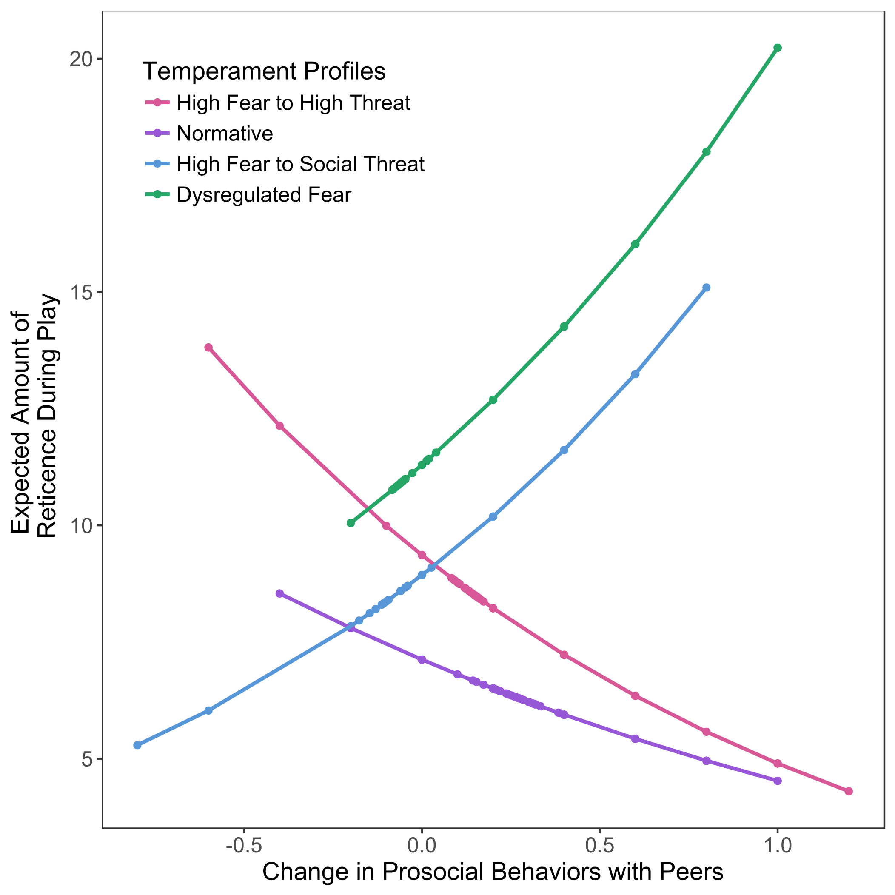

```{r setup, include=FALSE}
knitr::opts_chunk$set(echo = TRUE)
library(tidyverse)
```

## Acknowledgments

- [Psychology Department](http://psych.la.psu.edu)
- [Social, Life, & Engineering Sciences Imaging Center (SLEIC)](http://www.imaging.psu.edu)
- [Child Study Center's Open Data and Developmental Science (ODDS) initiative](http://csc.la.psu.edu/research/collaborative-research-initiatives)

## Agenda

- Welcome and introductions
- Housekeeping
- Schedule
- Aspirations & Philosophy
- The stoRy of R

## Welcome and introductions

- Michael Hallquist
- Rick Gilmore
- Nilam Ram

## Welcome and introductions

- Dan Albohn
- Kayla Brown
- Ben Johnson
- Alicia Vallorani

## Who R You?

```{r, include=FALSE}
# Modified by ROG on 2018-08-15 from Hallquist code

library(readr)
library(dplyr)
library(haven)
library(tidyr)
library(ggplot2)

survey_file_name <- "../data/R+Bootcamp+2018_August+13%2C+2018_10.49.sav"

df <- read_spss(survey_file_name) %>% 
  filter(DistributionChannel != "preview") %>%
  filter(Contact_2 != "Hallquist" & 
           !(is.na(Contact_1) & 
               is.na(Contact_4))) %>%
  select(Contact_1, 
         Contact_2, 
         Contact_3, 
         Contact_4, 
         Role, 
         Role_6_TEXT, 
         starts_with("Th"), 
         starts_with("Fr"))

role_labels <- c("Undergrad", "Grad", "Postdoc", "Faculty", "Staff", "Other")
#attr(x = df$Role, "labels")

df_demo <- data_frame(unit = df$Contact_3, 
                      role = factor(df$Role, 
                                    labels = c("Grad", 
                                               "Postdoc", 
                                               "Faculty", "Staff",
                                               "Other")))

df_demo$unit_normed <- df_demo$unit
df_demo$unit_normed[!is.na(str_match(df_demo$unit, "[Pp]syc"))] <- "Psychology"
df_demo$unit_normed[!is.na(str_match(df_demo$unit, "Adul"))] <- "Psychology"
df_demo$unit_normed[!is.na(str_match(df_demo$unit, "Human"))] <- "HDFS"
df_demo$unit_normed[!is.na(str_match(df_demo$unit, "HDFS"))] <- "HDFS"
# df_demo$unit_normed[!is.na(str_match(df_demo$unit, ""))] <- NA
df_demo$unit_normed[!is.na(str_match(df_demo$unit, "meth"))] <- "HDFS"
df_demo$unit_normed[!(str_detect(df_demo$unit, ""))] <- NA
```

<div class="centered">
```{r demo_plot, echo=FALSE}
ggplot(df_demo) +
  aes(x = role, fill = unit_normed) +
  geom_bar() +
  theme_set(theme_grey(base_size = 20)) +
  theme(legend.title=element_blank(),
        legend.position = "bottom")
```
</div>

## Housekeeping

- Bootcamp materials on GitHub: <https://github.com/psu-psychology/r-bootcamp-2018>
- Bootcamp website: <http://psu-psychology.github.io/r-bootcamp-2018>
- **Survey**: Please complete this anonymous (and light-hearted) [survey](https://docs.google.com/forms/d/1l5OX8PcN_lfVn3ykr_PtHCzhRbWzMbxhqtgILD45zRg/edit) *before lunch*.
- **Sessions are being video recorded**. Last year's is on [Databrary](http://doi.org/10.17910/B7.473)

## Schedule

- **Day 1** (Thursday, August 16, 2018): 104 Keller & 104 Rackley
- **Day 2** (Friday, August 17, 2018): 104 Keller

## Day 1 Schedule

||Plenary session, 104 Keller |
|-|-------------------------------------------------------|
|| 09:00 am • Welcome, introductions, & housekeeping     |
|| 09:15 am • Why We R Here                              |
|| 09:45 am • Break                                      |

## Day 1 Schedule

||Slow-R Track, 104 Keller |  Fast-R Track, 104 Rackley |
|-|---------------------------------------------------------|----------------------------------------------------------|
||10:00 am - 12:00pm  • RStudio, R console, object classes & data types (Rick Gilmore)                | 10:00 am - 12:00pm • Introduction to exploratory factor analysis (Nilam Ram)  |

</br>

||Lunch, Moore 1st floor lobby                         |
|-|------------------------------------------------------|
|| 12:00 pm • Lunch (thanks to the Child Study Center (CSC))|

## Day 1 Schedule

|| Slow-R Track, 104 Keller | Fast-R Track, 104 Rackley |
|-|---------------------------------------------------------|----------------------------------------------------------|
||1:00 pm - 1:45 pm • Data indexing and subsetting (Rick Gilmore) | 1:00 pm - 2:00 pm • Introduction to structural equation modeling in lavaan (Michael Hallquist)               |
||1:45 pm - 3:00 pm • Packages, scripts, & functions (Rick Gilmore) | 02:00 pm - 3:00 pm • Parallel computing, batch processing, and big data in R (Michael Hallquist)                |
|| 03:00 - 03:15 pm • Break                  | 03:00 pm - 03:15pm • Break                 |

## Day 1 Schedule

|| Plenary, 104 Keller                                     |
|-|------------------------------------------------------|
|| 03:15 pm • R-eproducible Science with R (Rick Gilmore) |
|| 04:30 pm • End                                            |
</br>

## Day 2 Schedule

|| Plenary                                   |
|-|------------------------------------------------------|
|| 09:00 am • Welcome back and Q&A |
|| 09:15 am • Data wrangling & pipelines (primarily tidyverse)
|| 10:30 am • Break |
|| 10:45 am • Data visualization (primarily ggplot2) |
|| 12:00 pm • Lunch (pizza & drinks thanks to [SLEIC](http://imaging.psu.edu)) 

## Day 2 Schedule

|| Plenary                                   |
|-|------------------------------------------------------|
|| 01:00 pm • Core programming skills: loops, apply functions, writing functions |
|| 02:00 pm • Best practices in R: script management, versioning, modular coding |
|| 02:45 pm • Break |
|| 03:00 pm • Basic data analyses in R: correlation, regression, ANOVA, categorical data | 
|| 04:30 pm • End |
|| 04:45 pm • Optional Happy Hour @ Whisker's |

## Aspirations & Philosophy

- You **can** learn to program
- You **should** learn to program
- R is a good language for learning programming

---

<div class="centered">

</div>

## The storRy of R

<div class="centered">
<a href="https://www.amazon.co.uk/Story-R-Gaia-Servadio/dp/0330332031">

</a>
</div>

## The storRy of [*our* R](https://en.wikipedia.org/wiki/R_(programming_language))
    
- What is R?
    - A programming language, written by and for statisticians & data scientists
- Why is it called R?
    - TLDR: it's the free, open-source version of a commercial program called S developed in the 1970s at Bell Labs
    - Bell Labs is also the home of C, and the Unix operating system
    
## The storRy of R

- Features of R
    - Written in C, Fortran, and R
    - 14th most [popular programming language](https://www.tiobe.com/tiobe-index/)
    - Base R (now 3.5.1) + thousands of packages
    - Object-oriented
    
## Using R

- On your own computer
- In the cloud from your browser
    - <https://lxclusterapps.tlt.psu.edu:8787>
    
## Some of ouR own eye-candy

```{r, include=FALSE}
#Thursday intro
table(df$ThIntro_1, useNA = "always") #52
 
#10am-12pm BASIC
table(df$ThParallel_1, useNA = "always") #41

#1pm-1:45pm BASIC data indexing
table(df$ThParallel_2, useNA = "always") #50

#1:45pm-3pm BASIC functions and packages
table(df$ThParallel_3, useNA = "always") #44

#10am-12pm EFA Ram
table(df$ThParallel_4, useNA = "always") #27

#1pm-2pm lavaan
table(df$ThParallel_5, useNA = "always") #22

#2pm-3pm parallel computing in R
table(df$ThParallel_6, useNA = "always") #29

#3pm-4:30pm reproducible R
table(df$ThEnd_1, useNA="always") #47


###
#Friday: 9:15am - 10:30am data wrangling 
table(df$Fr_1, useNA = "always") #59

#10:45am-12pm data visualization
table(df$Fr_2, useNA = "always") #60

#1pm-2pm core programming skills
table(df$Fr_3, useNA="always") #61

#best practices in R
table(df$Fr_4, useNA = "always") #58

#basic data analyses in R
table(df$Fr_5, useNA = "always") #59

df_agg <- df %>% 
  gather(key="Event", value="Count", starts_with("Fr"), starts_with("Th")) %>%
  group_by(Event) %>% 
  summarize(Attendance=sum(Count, na.rm=TRUE)) %>%
  mutate(Event=factor(Event, 
                      levels=c("ThIntro_1", 
                               "ThParallel_1", 
                               "ThParallel_2", 
                               "ThParallel_3", 
                               "ThParallel_4", 
                               "ThParallel_5", 
                               "ThParallel_6", 
                               "ThEnd_1", 
                               "Fr_1", 
                               "Fr_2", 
                               "Fr_3", 
                               "Fr_4", 
                               "Fr_5"),
                      labels=c("Th Intro", 
                               "Th Basic 10am", 
                               "Th Basic 1pm", 
                               "Th Basic 1:45pm", 
                               "Th EFA 10am", 
                               "Th lavaan 1pm", 
                               "Th big data 2pm", 
                               "Th Repro R", 
                               "Fr wrangling 9:15am", 
                               "Fr visualization 10:45am", 
                               "Fr core programming 1pm", 
                               "Fr best practices 2pm", 
                               "Fr analyses 3pm")
  ))
```

<div class="centered">
```{r plot_attendance, echo=FALSE}
ggplot(df_agg, aes(x=Event, y=Attendance)) + 
  geom_bar(stat="identity") + 
  theme_bw(base_size=17) + 
  theme(axis.text.x=element_text(angle=90))
```
</div>

---

<div class="centered">


[github.com/PLAY-behaviorome/](https://github.com/PLAY-behaviorome/)
</div>

---

<div class="centered">


[Gilmore, Thomas, & Fesi, 2016](http://dx.doi.org/10.1371/journal.pone.0157911)
</div>

---

<div class="centered">


<smaller>Alicia Vallorani</smaller>
</div>

---

<div class="centered">


<smaller>Alicia Vallorani</smaller>
</div>

## Your turn

- Why do you want to learn R?
- If you know some R, what else do you want to learn?
- Complete the [survey!](https://docs.google.com/forms/d/e/1FAIpQLSeGqic9Hrj-XvkESZmu_0t6H02R-U6yzYnRLuX6HDFDp4R39g/viewform?usp=sf_link)
- Testimonials?

## Next steps

- Slow R (stay here in 104 Keller)
- Fast R (104 Rackley Moore)
- Lunch (Moore Building Lobby)
