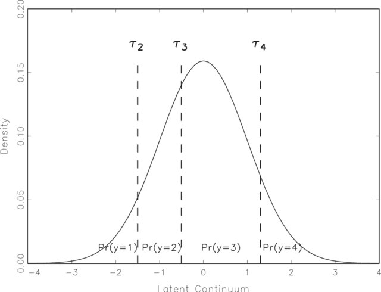

<style type="text/css">
body{ font-size: 20px; max-width: 1400px; margin: auto; padding: 1em; }
code.r{ font-size: 24px; }
pre { font-size: 20px; }
</style>

```{r setup, include=FALSE}
if (!require(pacman)) { install.packages("pacman"); library(pacman) }
p_load(knitr, ppcor, tidyverse, lavaan, modelr, mlbench, 
       lattice, lm.beta, semPlot, DiagrammeR, relaimpo)

knitr::opts_chunk$set(echo = TRUE) #print code by default
options(digits=3) 
```

# Introduction

There are several freely available packages for structural equation modeling (SEM), both in and outside of R. In the R world, the three most popular are `lavaan`, `OpenMX`, and `sem`. I have tended to prefer `lavaan` because of its user-friendly syntax, which mimics key aspects of of Mplus. Although `OpenMX` provides a broader set of functions, the learning curve is steeper.

Here, we will consider models in which all variables are observed/manifest, as well as models with latent variables. The first is sometimes called 'path analysis', whereas the latter is sometimes called a 'measurement model.'

# Use lavaan for simple multiple regression

SEM is largely a multivariate extension of regression in which we can examine many predictors and outcomes at once. SEM also provides the innovation of examining latent structure (i.e., where some variables are not observed). More specifically, the idea of 'structural equations' refers to the fact that we have more than one equation representing a model of covariance structure in which we (usually) have multiple criterion variables and multiple predictors.

Let's start with the simple demonstration that a path model in SEM can recapitulate simple single predictor-single outcome regression. We'll examine housing price data from Boston's 1970 census to review important concepts in correlation and regression. This is a nice dataset for regression because there are many interdependent variables: crime, pollutants, age of properties, etc.

We can estimate the same multiple regression models using the `lavaan` package that we'll be using for more complex SEMs. And the syntax even has many similarities with `lm()`.

Here's the single-predictor regression from above, run as a path model in `lavaan`:

```{r}
#example dataset from mlbench package with home prices in Boston by census tract
data(BostonHousing2)
BostonSmall <- BostonHousing2 %>% dplyr::select(
  cmedv, #median value of home in 1000s
  crim, #per capita crime by town
  nox, #nitric oxide concentration
  lstat, #proportion of lower status
  rad #proximity to radial highways
  ) %>% mutate(log_crim = log2(crim))

lavaan_m <- 'cmedv ~ log_crim'
mlav <- sem(lavaan_m, data=BostonSmall)
summary(mlav)
```

And for comparison, the output of `lm()`

```{r}
  summary(lm(cmedv ~ log_crim, BostonSmall))
```

The regression coefficient is identical (good!). One thing to note is that we don't have an intercept in the `lavaan` output. This highlights an important difference that basic SEM often focuses on the covariance structure of the data. We can include means as well, but typically only when it's relevant to our scientific questions. For example, do males and females differ on mean level of a depression latent factor?

## Mean structure 

We can ask `lavaan` to include the mean (intercept) in the model in this case using `meanstructure=TRUE`:
```{r}
mlav_w_intercept <- sem(lavaan_m, data=BostonSmall, meanstructure=TRUE)
summary(mlav_w_intercept)
```

## Details about parameters in the model
It's good to get in the habit of examining the 'parameter' table in `lavaan`, which provides an important summary of what parameters are free in the model (i.e., have to be estimated), and what parameters were requested by the user (you!) in the model syntax.
```{r}
parTable(mlav)
```

Here, 'user' refers to a parameter we've request explicitly in the syntax, and non-zero values for the 'free' column denote parameters that are freely estimated by the model.

Note that we can get standardized estimates in `lavaan` as well. This is a more complicated topic in SEM because we can standardize with respect to the latent variables alone (`std.lv`) or both the observed and latent variables (`std.all`). The latter is usually what is reported as standardized estimates in SEM papers.

## Standardized estimates
```{r}
standardizedSolution(mlav, type="std.all")
```

# Path analysis on housing data

Let's look at something more interesting. What if we believe that the level nitric oxides (`nox`) also predicts home prices alongside crime? We can add this as a predictor as in standard multiple regression.

Furthermore, we hypothesize that the proximity of a home to large highways (`rad`) predicts the concentration of nitric oxides, which predicts lower home prices?

The model syntax could be specified as:

```{r}
lavaan_m2 <- '
cmedv ~ log_crim + nox #crime and nox predict lower home prices
nox ~ rad #proximity to highways predicts nox
'
mlav2 <- sem(lavaan_m2, data=BostonSmall)
```

The model looks like this (using the handy `semPaths` function from `semPlot`):

```{r}
semPaths(mlav2, what='std', nCharNodes=6, sizeMan=10,
         edge.label.cex=1.25, curvePivot = TRUE, fade=FALSE)
```

Here's the text output:

```{r}
summary(mlav2)
```

A few things to note:

1. Note the warning: 'some observed variances are (at least) a factor 1000 times larger than others.' This is called ill conditioning.
2. Our hypotheses all seem to be supported.
3. The model chi-square is highly significant, suggesting poor global model fit.

## Ill conditioning

Parameter estimation can be hampered when the variances of variables in the model differ substantially (orders of magnitude). Given the above warning, let's take a look.

```{r}
varTable(mlav2)
```
Looks like the scale of `nox` is *much* smaller than any other predictor, likely because it's in parts per 10 million! We can rescale variables in this case by multiplying by a constant. This has no effect on the fit or interpretation of the model -- we just have to recall what the new units represent. Also, you can always divide out the constant from the parameter estimate to recover the original units, if important.

```{r}
BostonSmall <- BostonSmall %>% mutate(nox = nox*100) #not parts per 100,000 not 10 million
mlav2 <- sem(lavaan_m2, data=BostonSmall)
summary(mlav2)
```

## Model fit indices

You can request more detailed global fit indices from lavaan in the model summary output using `fit.measures=TRUE`.

```{r}
summary(mlav2, fit.measures=TRUE)
```

You can also get just the fit measures (including additional statistics) using `fitmeasures()`:

```{r}
fitmeasures(mlav2)
```

These look atrocious: CFI is < .95 (and much less than even .9), and RMSEA is much greater than the .08 level that we would consider just 'okay.'

## Model diagnostics

This suggests the need to examine the fit in more detail. First, we can look at the mismatch between the model-implied and observed covariance matrices.

Conceptually, the goal of structural equation modeling (SEM) is to test whether a theoretically motivated model of the covariance among variables provides a good approximation of the data.

More specifically, we are trying to test how well a parsimonious model (composed of measurement and/or structural components) reproduces the observed covariance matrix. Formally, we are seeking to develop a model whose *model-implied covariance matrix* approaches the *sample (observed) covariance matrix*.

$$
\mathbf{S_{XX}} \approx \mathbf{\Sigma}(\hat{\theta})
$$

We can obtain these from `lavaan` for further diagnosis of model misfit.

First, the model-implied covariance matrix:

```{r}
fitted(mlav2)
```
We might be able to interpret this more easily in correlational (standardized) units. That is, what's the model-implied correlation among variables? The `inspect` function in `lavaan` gives access to a number of model details, including this:

```{r}
inspect(mlav2, what="cor.all")
```

How does this compare to the observed correlations?
```{r}
lavCor(mlav2)
```

In particular, getting the misfit of the bivariate associations is very helpful. Here, we ask for residuals in correlational units, which can be more intuitive than dealing with covariances that are unstandardized. Note that this is the subtraction of the observed - model-implied matrices above. Large positive values indicate the model underpredicts the correlation; large negative values suggest overprediction of correlation. Usually values $|r > .1|$ are worth closer consideration.

```{r}
resid(mlav2, "cor")
```
So the model significantly underpredicts the association between `nox` and `log_crim`.

We could visualize the problems, too:
```{r}
plot_matrix <- function(matrix_toplot){
corrplot::corrplot(matrix_toplot, is.corr = FALSE,
               type = 'lower',
               order = "original",
               tl.col='black', tl.cex=.75)
}
plot_matrix(residuals(mlav2, type="cor")$cor)
```

## Modification indices
Let's take a look at the modification indices to see if we can fix the misfit by freeing one or more paths, particularly the relationship between `nox` and `log_crim`.

```{r}
modificationindices(mlav2, minimum.value = 20) #only print MIs > 20 
```

Here, we see that model fit would improve massively if we allowed `log_crim` to predict `nox`. Whether this makes theoretical sense is a different (and likely more important) matter. For demonstration purposes, let's accept that this path needs to be freely estimated.

```{r}
#we can use the add parameter to add a path, while leaving all other model elements the same
mlav3 <- update(mlav2, add="nox ~ log_crim")
summary(mlav3, fit.measures=TRUE)
```

This looks *way* better in terms of fit. There is a strong positive association between crime and nox levels that we missed before. Conceptually, this suggests that the relationship between crime and home prices is partially mediated by crime's effect on pollutant levels. By contrast, the effect of proximity to highways on home prices appears to be fully mediated by pollutant levels (as indicated by the absence of a large modification index for this path).

```{r}
semPaths(mlav3, what='std', nCharNodes=6, sizeMan=10,
         edge.label.cex=1.25, curvePivot = TRUE, fade=FALSE)
```

# Testing mediation

If the above model is supported and we were specifically interested in testing mediation, we would typically want to 1) test the indirect effects specifically, and 2) use a method for significance testing of the mediated effects that provides trustworthy *p*-values. As noted some time ago (e.g., MacKinnon et al., 2007), the appropriate test for mediation in an SEM framework is based on the *product* of the constituents paths that comprise the mediation. Here, we have just two paths in two mediational chains:

$$
\begin{align*}
\textrm{rad} &\rightarrow \textrm{nox} \rightarrow \textrm{cmedv} \\
\textrm{log_crim} &\rightarrow \textrm{nox} \rightarrow \textrm{cmedv} \\
\end{align*}
$$
To test these specifically, we need to define new parameters in the lavaan model that are a product of the individual paths. This can be accomplished using the `=:` operator ('defined as'). Note that this does change the number of free parameters in the model because these are just a product of existing parameters. To tell lavaan which estimates to multiply, we must use 'parameter labels' by pre-multiplying the variable by an arbitrary label. Here I've used 'a1' and 'a2' for the X -> M paths, and 'b1' for the M -> Y path (in Baron-Kenny terms).

```{r}
m_update <- '
cmedv ~ log_crim + b1*nox #crime and nox predict lower home prices
nox ~ a1*rad + a2*log_crim #proximity to highways predicts nox

i_1 := a1*b1
i_2 := a2*b1
'

mlav4 <- sem(m_update, BostonSmall)
summary(mlav4)
```
This looks promising, but as I noted above, this 'delta method' for testing mediation is known to be problematic because the sampling distribution of the indirect path product term is not normal. Bootstrapping is a common workaround for this dilemma that does not make strong assumptions about the distribution of the coefficient of interest (i.e., the sampling distributions of the two mediated paths). We can implement this using the argument `se = "bootstrap"`. This will reestimate the standard errors of the parameter estimates using 1000 nonparametric bootstrap samples, by default. You can change the number of bootstrap samples using the `bootstrap` argument

```{r}
mlav4_boot <- sem(m_update, BostonSmall, se = "bootstrap")
summary(mlav4_boot)
```

As we suspected, both indirect paths are significant, suggesting evidence for mediation.

# SEM with latent variables

What about when we are interested in testing models with latent variables? Typically this will be a 'reflective latent variable' model in which we think that a putative latent variable is measured by several (usually 3+) manifest indicators. Such variables are often called 'factors' or 'latent traits.' In an SEM world, confirmatory factor analysis is the most common reflective latent variable model.

Such models are specified in `lavaan` using the `=~` operator ('measured by').

Let's take the Holzinger-Swineford example from the lavaan tutorial, where there were 9 items that measured putatitively different facets of intelligence: visual, textual, and speed. The observed variables are `x1-x9`.

From the 'lavaan' [tutorial](http://lavaan.ugent.be/tutorial/index.html):

This is a 'classic' dataset that is used in many papers
and books on Structural Equation Modeling (SEM), including some manuals
of commercial SEM software packages. The data consists of mental ability
test scores of seventh- and eighth-grade children from two different
schools (Pasteur and Grant-White). In our version of the dataset, only 9
out of the original 26 tests are included. A CFA model that is often
proposed for these 9 variables consists of three latent variables (or
factors), each with three indicators:

-   a *visual* factor measured by 3 variables: `x1`, `x2` and `x3`
-   a *textual* factor measured by 3 variables: `x4`, `x5` and `x6`
-   a *speed* factor measured by 3 variables: `x7`, `x8` and `x9`

```{r echo=FALSE, message=FALSE}

HS.model <- ' visual  =~ x1 + x2 + x3
              textual =~ x4 + x5 + x6
              speed   =~ x7 + x8 + x9 '
fit <- cfa(HS.model, data=HolzingerSwineford1939)
```
```{r cfa, echo=FALSE, dev=c('png','pdf'), dpi=c(100,100), fig.cap="A 3 factor CFA example"}
semPaths(fit, layout="tree", curve=1, rotation=4, 
nCharNodes=0, mar=c(3,20,3,20), 
border.width=1.0, esize=1.0, edge.color="black", 
label.scale=FALSE,
label.cex=1.0,
residuals=FALSE,
fixedStyle=1,
freeStyle=1,
curvePivot=FALSE,
sizeMan=7, sizeLat=10)
```

## Specifying a factor model
The corresponding lavaan syntax for specifying this model
is as follows:

```
     visual =~ x1 + x2 + x3
    textual =~ x4 + x5 + x6
      speed =~ x7 + x8 + x9
```

In this example, the model syntax only contains three ‘latent variable
definitions’. Each formula has the following format:

```
    latent variable =~ indicator1 + indicator2 + indicator3
```

## Typical CFA output
By default, the first indicator has a fixed loading of 1 to scale the underlying factor (a 'unit loading identification'). Let's take a look:

```{r}
summary(fit, fit.measures=TRUE)
```

## Modification indices for CFA

```{r}
modificationIndices(fit, minimum.value = 10)
```

The modification indices suggest that the `x9` may load on the `visual` factor, or that `x7` and `x9` may have a unique residual correlation. This, again, is a problem for theory, but we can test a modified model for demonstration purposes. We use the `~~` operator to specify a (residual) variance or covariance term in the model.

```{r}
HS.model <- ' visual  =~ x1 + x2 + x3
              textual =~ x4 + x5 + x6
              speed   =~ x7 + x8 + x9 

x7 ~~ x9 #this specifies a variance or covariance parameter
'

fit2 <- cfa(HS.model, data=HolzingerSwineford1939)
summary(fit2, fit.measures=TRUE)

```

The still isn't great. We could re-examine modification indices

```{r}
modificationIndices(fit2, minimum.value = 20)
```

Hmm, even more possibilities have cropped up -- again, this would be the time to consult your prediction or theory about what the latent structure should be. This is a model building and model comparison problem, which is largely beyond the scope of this tutorial. Minimally, however, we could test the global fit differences between these models. These are nested models (because the `x7 ~~ x9` residual covariance is 0 in the simpler model), which allows us to use a likelihood ratio test (also called a model chi-square difference):

```{r}
anova(fit, fit2)
```

The `anova` function will test overall fit differences using an LRT approach. The degrees of freedom for the LRT is the difference in the number of free parameters (here, 1).

## Seeing the model specification in detail

We can use the `inspect` function in lavaan to look at where the free parameters are in matrix specification. The free parameters are numbered (sequentially) and the zeros denote possible parameters that fixed to zero (i.e., not estimated). `lavaan` uses the LISREL matrix specification to print the output. If you don't know about this, see here: <https://psu-psychology.github.io/psy-597-SEM/06_factor_models/factor_models.html>. And take a class on SEM to get a better sense.

```{r}
inspect(fit)
```

We can also see the parameter estimates in the matrix form:

```{r}
inspect(fit, "est")
```

## What about a structural model?

The CFA above contains only a measurement model -- a three-factor model with correlations among factors. What if we also want to see to what extent to which grade in school predicts levels on the intelligence factors (visual, textual, speed).

```{r}
HS.model <- ' visual  =~ x1 + x2 + x3
              textual =~ x4 + x5 + x6
              speed   =~ x7 + x8 + x9

visual ~ grade
textual ~ grade
speed ~ grade
'

fit_structural <- cfa(HS.model, data=HolzingerSwineford1939)
summary(fit_structural, fit.measures=TRUE)
```
```{r}
semPaths(fit_structural)
```

As one might expect, children in higher grades score higher on the latent intelligence factors.

Lastly, what if we want to use the general versus specific (residual) variance in a structural model? To get these to play appropriately in the same parameter matrices, we create a single-indicator latent variable for the item residual of interest.

```{r}
HS.model <- ' visual  =~ x1 + x2 + x3
              textual =~ x4 + x5 + x6
              speed   =~ x7 + x8 + x9 

x1d =~ 1*x1 #define disturbance factor with loading 1.0 onto indicator (as in RAM notation)
x1 ~~ 0*x1 #zero residual variance of indicator (all loads onto disturbance)

#under standard model, disturbances are uncorrelated with factors
x1d ~~ 0*visual
x1d ~~ 0*textual
x1d ~~ 0*speed

#we can now look whether the x1 specific variance and the visual factor uniquely predict the person age
ageyr ~ x1d + visual
'

fit_unique <- cfa(HS.model, data=HolzingerSwineford1939)
summary(fit_unique, fit.measures=TRUE)
```

No dice here (bad fit, nonsig structural estimates), but you get the idea.

# Categorical data

lavaan supports the formal treatment of endogenous categorical data using a threshold structure. This emerges from the view that the underlying distribution of an item is continuous (Gaussian), but our discretization (e.g., binary or polytomous) cuts this dimension at particular points. Here's an example from the Samejima graded threshold model:



We have 4 levels of the variable (1, 2, 3, 4), but only three thresholds -- each specifies the boundary between two adjacent levels (anchors). If we are motivated to account for this structure, these thresholds can be specified as free parameters in the model. This is essentially estimating where the $\tau$ parameters fall along the continuum; they need not be evenly spaced!

If we have 5+ anchors for an item, we can probably treat it as continuous without major missteps. See Rhemtulla et al., 2012, *Psychological Methods* for further details. Note that this is what we did above in the initial CFA -- we treated `x1 - x9` as normally/continuously distributed. It turns out that they are (i.e., not highly discretized):

```{r}
hist(HolzingerSwineford1939$x1)
```

But if we have data that have 2, 3, or 4 values, treating the variables as continuous is usually inappropriate and can lead to biased, inaccurate results.

Typically, models with a threshold structure are estimated using a 'weighted least squares' (WLS) estimator, rather than maximum likelihood (ML; the typical estimator in SEM). The mean and covariance adjusted WLS (aka 'WLSMV') is usually the way to go because it can handle nonnormality of the multivariate distribution better than the typical WLS. See DiStefano and Morgan 2014, *Structural Equation Modeling*, for details.

## Demo of categorical data in CFA

Here's a quick demo -- what if we had only trichotomous items for each of our intelligence test items?

```{r, echo=FALSE}
HSbinary <- as.data.frame( lapply(HolzingerSwineford1939 %>% dplyr::select(starts_with("x")), cut, 3, labels=FALSE) )
```

```{r}
hist(HSbinary$x1)
```

We tell `lavaan` which items are ordered categorial using the `ordered` argument.

```{r}
HS.model <- ' visual  =~ x1 + x2 + x3
              textual =~ x4 + x5 + x6
              speed   =~ x7 + x8 + x9 
'
fit_cat <- cfa(HS.model, HSbinary, ordered=names(HSbinary))
summary(fit_cat)

```

Note that we now have threshold estimates for each item, where higher values denote a higher estimate for the boundary between one category and the next along the latent continuum that putatively underlies the item. Additional details about categorical data are beyond the score here!

# Estimators

And finally, `lavaan` gives you a number of different algorithms to estimate parameters in the model. "ML" is the default for continuous data, "WLS" is the default for (partly) categorical data.

'Robust' variants of these estimators typically robustify the model to non-normality (and potentially other stuff like clustering) at the level of the overall model chi-square test and the standard errors and, therefore, the significance tests. Having your statistics be robust to non-normality is usually a good thing... So, many people would use 'MLR' as their go-to for continuous data and 'WLSMV' for categorical data.

You can specify this using the `estimator` argument.

```{r}
HS.model <- ' visual  =~ x1 + x2 + x3
              textual =~ x4 + x5 + x6
              speed   =~ x7 + x8 + x9 
'
fit_mlr <- cfa(HS.model, HolzingerSwineford1939, estimator="MLR")
summary(fit_mlr, fit.measures=TRUE)

```

Note that we now have a column of 'robust' global fit indices, as well as a note that standard errors are estimated using a Huber-White sandwich estimator (robust to non-normality and clustering).

# Missing data

By default, `lavaan` will usually apply listwise deletion such that people missing any variable are dropped. This is usually not a great idea, both because you can lose a ton of data and because it can give a biased view of the data (for details, see Schafer and Graham 2002, Psychological Methods). Although well beyond this tutorial, it's usually best to use so-called full-information maximum likelhood (FIML) under an assumption that the data are missing at random -- a technical term that missingness on a given variable can be related to other variables, but not to the variable itself. Using FIML, the estimation tries to estimate all parameters based on the cases that have available data. If you want to understand this better, read Craig Enders [great 2010 book](http://www.appliedmissingdata.com), *Applied Missing Data Analysis*.

In lavaan, add `missing='ml'` to the `cfa`, `sem`, or `lavaan` function calls.

I'm going to 'miss out' a few data points for illustration

```{r, echo=FALSE}
HolzingerSwineford1939_miss <- HolzingerSwineford1939
HolzingerSwineford1939_miss$x1[seq(1, 300, by=10)] <- NA
HolzingerSwineford1939_miss$x6[seq(2, 300, by=10)] <- NA
```


Here's what happens with the default:
```{r}
fit_listwise <- cfa(HS.model, HolzingerSwineford1939_miss, estimator="ML")
summary(fit_listwise, fit.measures=TRUE)
```

Note the output:
```
                                                 Used       Total
  Number of observations                           241         301
```

This should be very worrisome!!

Okay, here's under FIML

```{r}
fit_fiml <- cfa(HS.model, HolzingerSwineford1939_miss, estimator="ML", missing="ml")
summary(fit_fiml, fit.measures=TRUE)
```

And this is more reassuring:

```
  Number of observations                           301
  Number of missing patterns                         3
```

Again, the theory and formal approach to missing data is beyond this tutorial, but I hope this gives a sense of how to handle missingness in `lavaan`. Note that WLS and WLSMV are complete case estimators, so doesn't allow for the FIML approach (it's not an ML estimator, after all). You can pass `missing='pairwise'` for the WLS family, which also estimates using parameters based on pairwise availability, though in a much less elegant way (I think).

