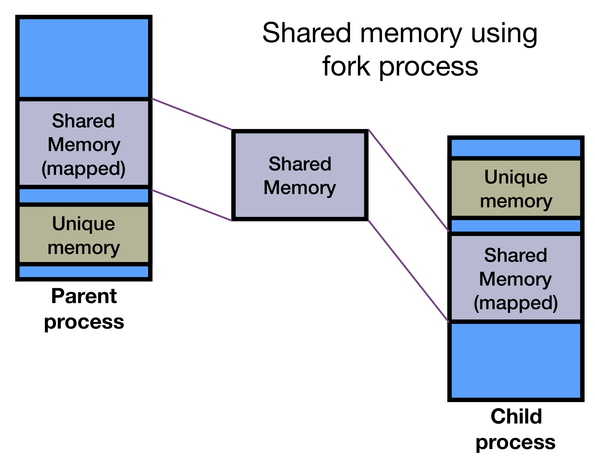

```{r setup, include=FALSE}
knitr::opts_chunk$set(echo = TRUE)
if (!require(pacman)) { install.packages("pacman"); library(pacman) }
p_load(dplyr, readr, tidyr, knitr, tictoc, parallel, foreach, doParallel)
p <- 1:12 #number of processors represented in figures
tictoc_time <- function(tocobj) { tocobj$toc - tocobj$tic } #little function to compute elapsed time from tictoc::toc() return
RNGkind("L'Ecuyer-CMRG") #necessary to make bootstrap resampling entirely comparable across jobs
```

The goal of this document is to provide a basic introduction to executing computations in parallel using R.

## Conceptual overview of parallel computing

Parallel computing has been supported in part by the ubiquity of multi-core, multi-processor computers that are capable of running many computations at once.

Parallel computing is largely motivated by the need to speed up computation, particularly when a given task reflects the repetition of one or more steps that are slow. Examples include repeating analyses over many units (e.g., analyses for each brain voxel), cross-validation, and nonparametric bootstrapping in which the data are resampled with replacement and the analysis is re-run.

To speed up computation, parallel methods typically divide the work to be done across a set of compute units (aka 'cores'), with each 'worker' process handling part of the larger queue. The data and tasks are divided among workers, then recombined after all workers have completed their parts.

### Key terms in parallel computing

- Node: a single computer consisting of a motherboard and some sort of operating system. Getting nodes to talk to each other is conceptually harder than having multiple processors or cores work together on one node.
- Processor (aka socket): the physical unit containing one or more cores that do the computation. 
- Core: the smallest computation unit of the processor, capable of running a single program/task.
- Multi-core processor: a physical processor in which many cores are embedded (e.g., a quad-core processor)
- Hardware thread (aka 'logical core'): A computation unit within a core that could allow the core to do 2+ things at once (see 'hyperthreading' in Intel i7 processors)
- Compute time (aka 'wall time'): The total (real) time your job takes to complete. In a cluster environment, you'll often need to ask for a maximum amount of time that the job will take.
- CPU hours: the number of hours it takes your job to run multiplied by the number of cores used. For example, a 2-hour job run on 10 cores requires 20 CPU hours.
- Speedup: improvement in compute time as a function of changes in the number of cores. For example, 'linear speedup' means that the job takes half as long if you double the number of cores. Used to quantify how well a computation parallelizes.
- Worker: an independent process (here, R) that conducts the computation and provides the results to the 'master' process.
- Chunk: the total volume of work, including data, to be completed by a worker before reporting back to the 'master' process.
- Serial execution: completing a queue of tasks one at a time (not parallel).
- Parallel execution: dividing the queue among many workers that compute at the same time.


## Key principles of parallel computing

### 1. Consider whether you have a large queue of repetitive tasks

The first principle to be aware of is the distinction between so-called 'single thread performance' for an irreducible task versus the potential that specific tasks are repeated many times across analysis units, datasets, and so on. Parallel computing in R is easy to implement for repetitive tasks such as running a model across many units.

If your task is taking a long time, ask yourself what steps are involved and whether the results of each step depend on each other. If tasks depend on each other, it is much harder to use parallelism to reduce compute time. Instead, you need to optimize the code itself, which is a topic beyond this simple tutorial!

Finally, don't assume parallel computing will help! If your task takes just a few minutes or hours to run, you may be (much) better off waiting patiently (or running things overnight) than investing time to code a parallel version.

Here's an example of a classic parallel problem from Levy et al., 2016 (https://esajournals.onlinelibrary.wiley.com/doi/10.1002/ecy.1444). In short, these authors were interested in modeling changes in environmental variables such as wind speed and soil temperature. But the scale of this analysis spans most of North America and includes hourly recordings over decades.


Conceptually, the goal is to run a climate model in each geospatial location (down to about $36\textrm{km}^2$ and one hour), which is a big queue of repetitive tasks!

### 2. Assess the independence of tasks

The second principle is that parallel computing is simplest and most tractable when the task queue can be divided into chunks that are completely independent of each other.

Many computations do not benefit from parallelism because the rate-limiting step is a single, complicated algorithm in which the results of one piece depend on the previous piece. For example, some latent variable analyses such as growth mixture models can be very slow to estimate, but this is difficult to speed up because in maximum likelihood, one derives parameter estimates iteratively, refining the estimates from one iteration to the next.

Thus, in ML estimation, one cannot easily divide the estimation into parts and hand these off to different cores because the estimation proceed sequentially. There are parallel solutions for many hard problems like this, but they are more in the realm of computer science than a quick solution using existing R packages.

### 3. The setup and teardown of parallel workers takes time!

In many cases, parallel computing involves starting a set of worker processes, then shuttling data back and forth as needed. In R, there are one-time setup costs for workers that include loading relevant packages when the worker is created. Although computers have gotten more efficient at copying data in memory, this is still a big bottleneck in parallel computing.

Consequently, your job should take long enough that the setup time for worker processes is a net gain for the compute time. 

Analogy: if a skilled glassblower can produce three wine bottles in an hour, the utility of hiring many more glassblowers and setting up multiple workshops depends on how many total bottles are needed. If the company only needs 100 wine bottles, this will take less than a week for one glassblower, whereas setting up many parallel glassblowers would probably take weeks or months. On the other hand, if the company needs 1,000,000 bottles, the time involved in hiring and setting up 10 glassblowers may be well worth it to complete the job in a timely fashion.

{width=50%}

**versus**

{width=50%}

A corollary of the setup/teardown principle is that workers should be given substantial work to do on every iteration. If a worker is repeatedly handed a task that takes only milliseconds to complete, the worker will spend most of its time shuttling data back and forth, which may be slower than running a task serially. For example, if you need to run 10 models for 1000 data units (e.g., brain regions) and each model takes 2 seconds, it is usually better to parallelize over the models (1000 units per worker) than the other way around. Though this means you can only scale to 10 processors. The alternative is to chunk compute tasks manually (see below).

### 4. Keep an eye on memory usage by workers

Although R provides some convenience tools to reduce the amount of data transferred to workers, you have to keep an eye on this yourself. That is, be sure that each worker has only the smallest amount of 'stuff' needed to do its work. By 'stuff,' I mean, data, packages, and code that are required to complete the task. See `.noexport` in the `foreach` package. Likewise, use Activity Monitor on mac, 'top' on Linux, or 'Task Manager' on Windows to monitor things. You can also call `object.size` to examine one object, `gc` to clean up memory manually, or `pryr::mem_used()` to look at total memory used by a given R process.

For additional guidance see Hadley Wickham's guide: <http://adv-r.had.co.nz/memory.html>.

### 5. Parallel computing over a queue is a classic split-apply-combine problem

Credit: Jonathan Dursi <https://github.com/ljdursi/beyond-single-core-R/>

Popularized by Hadley Wickham, the split-apply-combine nomenclature has become a model for thinking about data analysis in the R tidyverse.

Split the data set up into relevant sub-sets; apply some analysis to it; combine the results.

This is exactly the way to think about scalable data analysis.  Split the data - 
or tasks on that data - up between computing elements; do the analyses; then combine
the results somehow.

The details depend a great deal on the analyses (and the nature of the data.)

{width=30%}

## Considering and testing speedup

If the total compute time needed to process a queue scales linearly with the number of cores used in parallel, we say the problem has 'linear speedup.' This is the *best case scenario*, sometimes referred to as an 'embarrassingly parallel' problem. Much of the time, however, the compute time hits an asymptotic wall where the benefits of using additional cores are outweighed by the costs of coordinating information flow among so many workers. Although the details are beyond the scope of this tutorial, this asymptotic function may follow Amdal's law:

### Amdal's law

$$
T \approx \left ( f + \frac{1 - f}{P} \right )
$$

where $T$ is the compute time, $f$ is the proportion of computation time that must be performed serially, and $P$ is the number of cores.

This asymptotic pattern reflects that part of the overhead of distributing data to and assembling results from each worker needs to be done serially by the 'master' process. The asymptote is even lower (i.e., speedup is worse) if the data and results must be transferred over the network to different nodes, rather than running on one node with shared memory (RAM).

```{r echo=FALSE}
#code from: https://github.com/ljdursi/beyond-single-core-R/
amdall.efficiency <- function(f,p) (1./p) / (f + (1.-f)/p)
serial.fracs <- seq(0.,.75,by=.15)
eff <- matrix(nrow=length(serial.fracs), ncol=length(p))
for (i in 1:length(serial.fracs)) {
  eff[i,] <- sapply(p, function(np) amdall.efficiency(serial.fracs[i], np))
}
matplot(t(eff), type = c("b"), pch=16, xlab="Number of Processors", ylab="Efficiency", col=1:6)
legend("topright", legend = serial.fracs,  pch=16, col=1:6, title="Serial Fraction")
```

### How to approach speedup testing

The first step in testing speedup is typically to estimate the speed of single-threaded computation on a smaller queue. For example, if you have 50 million items in the queue (e.g., models x datasets x bootstrap samples), how many can one core clear in 10 minutes? This gives you an estimate of how many cores you may wish to consider and how long the compute time will be in parallel. Note that the single-threaded performance doesn't account for the slowdown associated with distributing information among the workers (Amdal's law).

*Note*: testing speedup is probably only worth the time investment if you anticipate the full analysis taking a very long time, even in parallel. For example, if your initial tests suggest that a single thread can clear 1,000 items from the queue in 30 minutes and you have 20 million items, it's probably worth it because your estimated compute time is 10,000 hours, or about 417 days... On the other hand, if you think the serial compute time is closer to 40 hours, you might try using nearly all the cores on your machine/node (e.g., 4 or 8) and see how things go.

For testing speedup, you usually want to use a smaller, but representative, subset of the data. For example, if you will be running multilevel models for 1000 nonparametric bootstrap samples and are considering using between 2 and 20 cores, you might start by looking at speedup on 20 or 40 datasets, or you might try running the models on a subset of the observations. For example, instead of estimating the model with the actual $N$ (e.g., 50,000), run the full analysis on a random sample of 5,000. This will give you a sense of speedup without the potentially long wait time of running the full analysis.

## Basic parallelism in R using the parallel package

Since R 2.14, the `parallel` package has been a useful tool for parallel computing in 'base R' (i.e., no add-on packages needed). The `parallel` package provides a low-burden approach to parallel computing by extending conventional `*apply` functions in `R` (e.g., `lapply` or `apply`). Because the `*apply` family is already organized around a loop structure (e.g., over rows in a matrix or elements of a list), the parallel variants simply divide the work among 2+ worker processes, which can be started and managed by the package without your involvement.

As a motivating example (adapted from Matt Jones' [parallel R tutorial](https://nceas.github.io/oss-lessons/parallel-computing-in-r/parallel-computing-in-r.html)), 
let's consider estimating a model in which we predict whether an iris (flower)  is a 'setosa' species or a 'versicolor' species as a function of the flower's sepal length. This will be a logistic model in which we predict the probability of being a setosa given the sepal length.

We'll start by looping over samples using a `for` loop, which is not the 'right' way to do this, even though it is often convenient. Why is this potentially bad? A loop in `R` is evaluated code in which, conceptually, each line of the loop is evaluated and interpreted in sequence. As you go from one iteration to the next, the code is evaluated over and over. Depending on how much code is in the loop, it can be slower, occasionally substantially, compared to the corresponding `*apply` function. Details of this are beyond the scope of the tutorial, but see here: https://stackoverflow.com/questions/2275896/is-rs-apply-family-more-than-syntactic-sugar. 

### Sidebar on loops: when parallelism is not the answer to compute time

I'm not anti-loops. Sometimes a loop is just as fast as an `*apply` call and is much more intuitive to read. There are, however, a few cases where a loop is a terrible idea:

1. Building up a very large object one iteration at a time (e.g., adding 1 million rows to a `data.frame` one at a time).
2. Populating selected cells of a large array one at a time, especially in a nested loop (e.g., in spatial data such as fMRI).
3. Computing something sequentially that could be computed all at once. The latter is called 'vectorized' computation because the operation works with an entire vector or matrix at once, rather than individual steps in a loop.

Here's an example of a bad loop using simulated data for 1000 'people' and 200 'variables.' Imagine that we want the 200 x 200 correlation matrix. We could compute each cell in the matrix sequentially, or we could pass the entire data matrix to the `cor` function at once. Which will be faster?

```{r}
#made up data with 1000 'people' and 200 'variables'
random_data <- matrix(rnorm(200000), nrow=1000)

tic("vectorized cor() on whole data matrix")
cor_mat <- cor(random_data)
vec_time <- toc()
```
And now in a double for loop...
```{r}
cor_mat <- matrix(NA, nrow=ncol(random_data), ncol=ncol(random_data)) #empty 200 x 200 matrix
tic("cell-by-cell correlation using double for loop")
for (i in 1:nrow(cor_mat)) {
  for (j in 1:ncol(cor_mat)) {
    cor_mat[i,j] <- cor(random_data[,i], random_data[,j])
  }
}
seq_time <- toc()
```

```{r echo=FALSE}
cat("The sequential version is: ", tictoc_time(seq_time)/tictoc_time(vec_time), "x slower than the vectorized version!\n", sep="")
```

The solution here is not to make the computation parallel, but to use the already-vectorized function `cor` to do the work. The take home is: if you can avoid loops in favor of vectorized (all-at-once) operations, you (almost always) should!

### Quick example of mclapply

Okay, let's get back on track with our bootstrapping example using a serial approach.

```{r}
iris_2species <- iris %>% dplyr::filter(Species != "virginica")
bootstrap_samples <- 10000
nobs <- nrow(iris_2species)

set.seed(1001) #for synchronizing bootstrap resampling precisely across different methods
tic("for loop bootstrapping")
res <- data.frame()
for (trial in 1:bootstrap_samples) {
  ind <- sample(nobs, nobs, replace=TRUE) #indices for resampling with replacement
  shuf_df <- iris_2species[ind,]
  
  m_out <- suppressWarnings(glm(Species ~ Sepal.Length, shuf_df, family="binomial"))
  res <- rbind(res, broom::tidy(m_out)) #handy function for building data.frame of model coefficients
}
serial_time <- toc()
```
About 30 seconds on this machine... Could we do better?

Here's the equivalent using `lapply` (note that the `map` function in the `purr` package would be pretty helpful here, too).

```{r}
set.seed(1001)
tic("bootstrapping with lapply")
res_lapply <- lapply(1:bootstrap_samples, function(trial) {
    ind <- sample(nobs, nobs, replace=TRUE) #indices for resampling with replacement
    shuf_df <- iris_2species[ind,]
    
    m_out <- suppressWarnings(glm(Species ~ Sepal.Length, shuf_df, family="binomial"))
    broom::tidy(m_out) #handy function for building data.frame of model coefficients
})


#note that res is currently a list of data.frames from each iteration. We want to combine these into a single data.frame
res_lapply <- dplyr::bind_rows(res_lapply)

lapply_time <- toc()
```

Note how much faster `lapply` is in this case (about 33%)! We'd have to do further code analysis to understand the details, but my strong hunch is that slowly growing the `res` object using repeated rbind calls generates a lot of unnecessary overhead.

Moving onto the parallel computing with `mclapply`, let's start by figuring out how many cores we could potentially abuse on this machine:

```{r}
detectCores()
```
(I get 8 here on my MacBook Pro. You may get a different number.)

Note, however, that this number typically includes so-called 'logical cores' (i.e., a hardware thread) in which independent computations can occur nearly simultaneously within a single core (most common on Intel i7 processors, which support 'hyperthreading'). Usually, this is a good upper bound, but if you want to restrict yourself to physical cores, specify:

```{r}
detectCores(logical = FALSE)
```

The `mclapply` and `parLapply` functions in the `parallel` package provide convenient parallel equivalent of `lapply`. What's the difference?

* `mclapply` does not actually work in parallel on Windows... it just runs serially (this has to do with how workers are managed)
* `mclapply` sets up the pool of worker processes itself using the `mc.cores` argument, then shuts them down when this computation completes
* `mclapply` uses a 'fork cluster' (see below), which means that objects and packages from the master are automatically available.
* `parLapply` expects you to have setup a pool of workers yourself, typically using the `makeCluster` function. You pass in this pool as an argument to `parLapply`.
* `parLapply` uses a 'socket cluster' by default, if you use the `makeCluster` function to setup the workers. In this case, packages and objects are not automatically sent to the workers. If you want similar functionality to `mclapply`, use `makeForkCluster`.

Why would one choose `mclapply` or `parLapply`? If you have a number of different computations that will complete in parallel, but at different points in the script, it's probably best to setup the worker pool yourself once and using `parLapply`, rather than having `mclapply` set it up each time (see points above about the overhead of creating worker processes). Likewise, if you're on Windows, `parLapply` is clearly the way to go. The convenience of `mclapply` is that you don't have to manage the setup and teardown of workers.

In short, I would recommend managing the pool yourself and using `parLapply` in most cases. It requires more manual input, but also gives you greater control. But let's see the value of `mclapply`.

```{r}
nworkers <- detectCores() #for this example, use all cores on this machine.
set.seed(1001) #for synchronizing bootstrap resampling precisely across different methods
tic(paste("bootstrapping using mclapply and", nworkers, "workers"))
res_mclapply <- mclapply(1:bootstrap_samples, function(trial) {
    ind <- sample(nobs, nobs, replace=TRUE) #indices for resampling with replacement
    shuf_df <- iris_2species[ind,]
    
    m_out <- suppressWarnings(glm(Species ~ Sepal.Length, shuf_df, family="binomial"))
    broom::tidy(m_out) #handy function for building data.frame of model coefficients
}, mc.cores=nworkers) #use all the cores on this machine
res_mclapply <- dplyr::bind_rows(res_mclapply)
mclapply_time <- toc()
```

And here is the equivalent with `parLapply`:

```{r}
tic(paste("bootstrapping using parLapply and", nworkers, "workers"))
cl <- makeCluster(nworkers)
clusterSetRNGStream(cl, 1001) #make the bootstrapping exactly the same as above to equate computation time
clusterExport(cl, c("nobs", "iris_2species")) #note that by default, objects are not shared with workers -- we need to 'export' them manually
res_parLapply <- parLapply(cl, 1:bootstrap_samples, function(trial) {
    ind <- sample(nobs, nobs, replace=TRUE) #indices for resampling with replacement
    shuf_df <- iris_2species[ind,]
    
    m_out <- suppressWarnings(glm(Species ~ Sepal.Length, shuf_df, family="binomial"))
    broom::tidy(m_out) #handy function for building data.frame of model coefficients
})

res_parLapply <- dplyr::bind_rows(res_parLapply)

stopCluster(cl)
parLapply_time <- toc()
```

```{r, echo=FALSE}
#equating RNG seeds not working as expected in mclapply and parLapply (come back later)
#all.equal(res_lapply$estimate, res_parLapply$estimate)
#all.equal(res_lapply$estimate, res_mclapply$estimate)
#all.equal(res_lapply$estimate, res$estimate)
```

Here is the summary of timing with different methods:

```{r}
timing <- tribble(
  ~method, ~time,
  "for loop", tictoc_time(serial_time),
  "lapply", tictoc_time(lapply_time),
  "mclapply", tictoc_time(mclapply_time),
  "parLapply", tictoc_time(parLapply_time)
)

kable(timing)
```

Why is `mclapply` somewhat faster? The short answer is that the workers for `mclapply` are started using a 'fork', where the workers for `makeCluster` are started using a 'socket'.

### Forking (not on Windows)

In the parallel package, there is a fundamental difference between a 'socket' cluster and a 'fork' cluster. A 'socket' cluster starts individual R processes by running the `Rscript` command on the target, which can be on the same machine (typically), or can be on another node. If the target is another node, the data and communication typically travel over the ssh (secure shell) protocol. This is done by 'serializing' objects, which is a bit like dehydrating them so that they can be sent over the network, and then 'deserialized' (rehydrated) by the master process. (See below for details about multi-node computation.)

Note that by default, `makeCluster` calls `makePSOCKcluster` behind the scenes. As the documentation (`?makeCluster`) notes: 

```
‘makePSOCKcluster’ is an enhanced version of ‘makeSOCKcluster’ in
     package ‘snow’.  It runs ‘Rscript’ on the specified host(s) to set
     up a worker process which listens on a socket for expressions to
     evaluate, and returns the results (as serialized objects).
```

The 'PSOCK' stands for POSIX socket, which is an old Unix term for a process that listens on a certain address (port) on your computer for communications. By contrast, a 'fork' cluster starts R processes using a 'fork process', which essentially creates a clone of the original (R) process without copying any of the memory used by the process. Instead, both the 'parent' process and the spawned 'child' process can refer to the same address space in the system's memory. Forking is available on Unix-like systems including Linux and Mac, but is not available on Windows. The benefit of a fork is that the overhead of setting up objects in the R environment is minimal and you also don't have to setup the environment yourself. Fork clusters can also be a boon to memory management/overhead as long as you do not modify large objects in the R environment. That is, if you leave the large objects alone, the system will not have to use additional RAM to represent them because all forks can point to the same address.



The downside is that forks have to live on the same node (unlike the socket cluster) because they share memory. See below for details about multi-node parallelism (e.g., on Penn State's ICS ACI clusters).

### parLapply using a fork cluster

We can explicitly request a fork cluster, while still having the manual control of `parLapply` using the `makeForkCluster` function. This also means we can skip the `clusterExport` call because the memory between child processes is shared using a fork (assuming you don't modify the object). Note that this code is otherwise the same as the `parLapply` chunk above.

```{r}
tic(paste("bootstrapping using parLapply, fork cluster, and", nworkers, "workers"))
cl <- makeForkCluster(nworkers)
clusterSetRNGStream(cl, 1001) #make the bootstrapping exactly the same as above to equate computation time
res_parLapply_fork <- parLapply(cl, 1:bootstrap_samples, function(trial) {
    ind <- sample(nobs, nobs, replace=TRUE) #indices for resampling with replacement
    shuf_df <- iris_2species[ind,]
    
    m_out <- suppressWarnings(glm(Species ~ Sepal.Length, shuf_df, family="binomial"))
    broom::tidy(m_out) #handy function for building data.frame of model coefficients
})

res_parLapply_fork <- dplyr::bind_rows(res_parLapply_fork)

stopCluster(cl)
parLapply_fork_time <- toc()

```

We see some improvement using the explicit fork cluster, but may not get to the level of `mclapply` because the latter uses low level functions such as `mcfork` to get the parallelism done. Nevertheless, this overhead difference is small, and you wouldn't expect it to increase with longer computation jobs (hours, days) since it's a one-time setup cost.

```{r}
timing <- bind_rows(timing,
  tibble(method="parLapply_fork", time=tictoc_time(parLapply_fork_time)))

kable(timing)
```


### Other handy functions in the parallel package

In addition to `parLapply` and `mclapply`, the `parallel` package offers many other parallel equivalents of base R functions. In particular:

* `parSapply` is the equivalent of `sapply` (which is largely like lapply, but with an attempt to simplify the returned structure)
* `parApply` is the equvalent tof `apply` (iterate of dimensions of a `matrix` or `array`)
* `parRapply` iterates over rows of a matrix in parallel; essentially the equivalent of apply(x, 1, FUN)
* `parCapply` iterators over columns of a matrix in parallel; essentially the equivalent of apply(x, 2, FUN)

There are also 'load-balancing' versions of many of these functions ending in "LB" (e.g., `parLapplyLB`). These keep an eye on the availability of worker processes, distributing additional work to workers that are idle. This is useful when iterations of the individual calculations vary substantially in compute time. But it has the downside that jobs are distributed to workers one at a time, so there could be much higher memory transfer overhead (i.e., slower).

To run a given chunk of code identically on all workers, use `clusterEvalQ`. For example, if we wish to load a library on all workers one time, we should use something like this:

```{r, eval=FALSE}
clusterEvalQ(cl, library(igraph))
```

Note that this is useful for one-time execution. You wouldn't want to run the above chunk in a `par*apply` function because then it would be evaluated on each iteration, which could slow things down.


## Extending parallel computing using the foreach and doParallel packages

The `par*apply` family is handy for parallel execution, but keeps you tethered to the `*apply` family from R. If you want a more general mechanism for parallel computing that stay closer to the conventional `for` loop, use the `foreach` package. Conceptually, this package seeks to create a parallel version of the for loop, allowing potentially more intuitive syntax and finer control over how the results from each iteration are combined.

Another difference from the `parallel` package is that you need to 'register' the parallel workers after you've set them up. This mostly just tells `foreach` where to look for resources.

Rather than get into all of the nitty gritty, I'll just give you an example here of how to achive the same bootstrapping results above within the `foreach` package. More information is provided here: <https://cran.r-project.org/web/packages/doParallel/vignettes/gettingstartedParallel.pdf>

```{r}
tic(paste("bootstrapping using foreach function with a fork cluster, and", nworkers, "workers"))
cl <- makeForkCluster(nworkers)
clusterSetRNGStream(cl, 1001) #make the bootstrapping exactly the same as above to equate computation time
registerDoParallel(cl) #tell foreach to use this cluster

#note the use of '.packages' explicitly tells foreach what packages are needed inside workers
res_foreach_fork <- foreach(trial=1:bootstrap_samples, .packages="broom", .inorder=TRUE) %dopar% {
    ind <- sample(nobs, nobs, replace=TRUE) #indices for resampling with replacement
    shuf_df <- iris_2species[ind,]
    
    m_out <- suppressWarnings(glm(Species ~ Sepal.Length, shuf_df, family="binomial"))
    broom::tidy(m_out) #handy function for building data.frame of model coefficients
}

res_foreach_fork <- dplyr::bind_rows(res_foreach_fork)

stopCluster(cl)
foreach_fork_time <- toc()
```

Here's the updated timing:
```{r}
timing <- bind_rows(timing,
  tibble(method="foreach_fork", time=tictoc_time(foreach_fork_time)))

kable(timing)
```


### Key arguments to foreach function

The `foreach` function accepts a number of handy arguments, including:

* `.packages` tells `foreach` to ensure that all specified packages are loaded inside workers
* `.export` tells `foreach` to export specific objects to workers. Note: foreach tries to figure this out itself based on what code is inside the loop curly braces `{}`. But if there are subsidiary functions that are not evident, you may need to export these explicitly.
* `.noexport` tells `foreach` not to export the specified variables to workers. This helps to reduce memory footprint in workers and give you control over mitigating how much RAM is demanded by each worker.
* `.inorder` is `TRUE/FALSE` and denotes whether the reassembled data need to be in the same order as the original. If `FALSE`, the data are reassembled as the 'come in' from the workers, which can speed things up slightly depending on circumstance.
* `.combine` is the function that should be used to combine individual outputs from the workers. Examples: `c()`, `rbind()`.
* `.multicombine` is `TRUE/FALSE` and denotes whether the `.combine` function can accept many arguments. For example, `rbind` accepts many inputs `rbind(...)`.

You can also specify a custom function for combining results, which is handy if you want things to be in a very specific format. For example, in an fMRI analysis, I wanted to combine network-wise results along the 4th dimension, where dimensions 1, 2, 3 were x, y, and z in the spatial domain.

```{r, eval=FALSE}
comb4d <- function(...) { abind(..., along=4) }
masks <- foreach(ic=tmap_filenames, .inorder=TRUE, .combine=comb4d, 
                 .multicombine=TRUE, .packages=c("fmri")) %dopar% {
  ##do stuff here
}
```

### Serial execution in foreach

Another handy feature is that you can request that the code be executed serially, not in parallel, with the simple switch from `%dopar%` to `%do%`. Why would you want to do this? The main use of this (in my mind) is to prototype and debug the code serially, using `%do%` on a smaller set of data (e.g., `foreach(i = 1:2)` instead of `foreach(i = 1:100000000)`), since in serial execution you can see what's printed to the screen and you can use interactive debugging tools like `browser()` to help you identify problems. Once you've got this working satisfactorily, switch to `%dopar%` and go get coffee!

In addition, there are cases where you need determine serial versus parallel execution inside a function, where you don't want to go mucking around with code once it's working. In this case, note that there is `registerDoSEQ()`, which explicitly tells `foreach` to execute serially even if `%dopar%` is encountered.

Example:

```{r, eval=FALSE}
do_crazy_computations <- function(data, ncpus=2) {
  require(foreach)
  
  if (ncpus > 1) {
    clusterobj <- makePSOCKcluster(ncpus)
    cat(" running parallel")
    registerDoParallel(clusterobj)
    on.exit(try(stopCluster(clusterobj)))    
  } else {
    cat("running sequentially")
    registerDoSEQ()
  }
  
  x <- foreach(iter(data)) %dopar% {
    #this will run serially anyhow if ncpus==1
  }
}
```

Actual exampled embedded here: <https://github.com/PennStateDEPENdLab/clinical_network_sim/blob/master/simulate_clingraph.R>

## Trapping errors to avoid crashing the whole parallel process

One somewhat infuriating aspect of parallelism in R is that the process may crash in a worker, but the rest solider on as if nothing happened. Once things wrap up, however, you'll get message such as: 

```
Error in { : task 1 failed - "object 'B' not found"
```

And you'll have nothing to show for your work! That is, the output (object) you're trying to create will be empty because the process failed. It could be many hours until you hit this snag. The short version is that you should try to catch (aka 'trap') errors as they arise, handling them gracefully by returning some value (e.g., `NA` or `NULL` to denote a failure) in the resulting out.

The primary mechanism for this is the `tryCatch` function in R. Check it out! Here's a very simple example of a worker funciton that estimates a multilevel model, but returns `NULL` if things fail:

```{r, eval=FALSE}
#worker function for fitting lmer and returning essential statistics
lmer_df <- function(f, df, mname, REML=FALSE) {
  
  #disable REML by default to allow for AIC comparisons
  #use tryCatch to handle model fitting failures gracefully, avoiding broader crashes of computation loop
  m <- tryCatch(lmer(f, df, REML=REML), error=function(e) { print(e); return(NULL) })
  if (!is.null(m)) {
    ret_df <- broom::tidy(car::Anova(m, type=3)) %>% mutate(group="anova") %>% bind_rows(broom::tidy(m))
    ret_df$Time <- df$Time[1]; ret_df$Freq <- df$Freq[1]; ret_df$model <- mname; ret_df$AIC <- AIC(m)
    diag <- ad.test(resid(m)) #anderson darling normality test
    ret_df$resid_W <- diag$statistic; ret_df$resid_p <- diag$p.value
    
    #DHARMa checks on residuals
    dout <- simulateResiduals(fittedModel = m, refit = FALSE, n=500)
    uniftest <- testUniformity(dout)
    ret_df$simresid_KS_D=uniftest$statistic; ret_df$simresid_KS_p=uniftest$p.value     
    
    return(ret_df)
  } else {
    return(NULL)
  }
}
```

This comes from the longer [worked example](../R/clock_MEG_lmer.R) of large-scale parallel computing in R.

## Multi-node parallelism

If you have very large parallel computing problems that are likely to scale well beyond one node (i.e., physical machine), a socket cluster can launch worker processes on separate nodes, communicating with these over the network. This depends on handling authentication among the machines, typically using ssh. This is much easier if you have ssh public key authentication setup among the nodes since that prevents the cluster from needing passwords at startup.

If you are using a Portable Batch System (PBS) cluster, which use 'torque' or 'moab' schedulers to handling high-performance computing, you should have access to an environment variable called `PBS_NODEFILE` inside your compute session (i.e., when the job is launched by the scheduler). You can pass a character vector of the 

```{r, eval=FALSE}
f <- Sys.getenv('PBS_NODEFILE')
nodelist <- if (nzchar(f)) readLines(f) else rep('localhost', 3) #fall back to a 3-worker setup on this machine if nodefile missing

cat("Node list allocated to this job\n")
print(nodelist)
```

Here, we have been allocated compute space on two separate nodes (0232, 0236).
```[1] "comp-sc-0236" "comp-sc-0236" "comp-sc-0232" "comp-sc-0232"```

```{r, eval=FALSE}
#launch processes on the corresponding nodes
cl <- makePSOCKcluster(nodelist, outfile='')
```

## Stuff to be aware of that goes beyond this basic intro

### Iterators

The `foreach` package was developed alongside the `iterators` package. The latter provides handy tools for dividing large datasets into chunks, then passing these chunks to workers. This prevents workers from needing access to the whole (potentially huge) object. For example, you can iterate over rows of a large data.frame or elements of a huge list.

See here: <https://cran.r-project.org/web/packages/iterators/vignettes/iterators.pdf>

### Chunking large objects manually

Relatedly, note that it is sometimes useful to get involved directly in how the data are chunked prior to sending them to workers. To cut down on the back-and-forth between master and worker and processes, it's often useful to send a big chunk at once. This can be accomplished by using the `split` function in base R to split data into chunks. Or you can use the `iter` function (and its cousins) from the `iterators` package.

```{r, eval=FALSE}
vv <- data.frame(x1=rnorm(1000), x2=rnorm(1000))
ncores <- 6
chunked_df <- iter(vv, by="row", chunksize=40) #each worker processes 40 rows at a time
result <- foreach(to_compute=chunked_df) %dopar% {
  #do stuff here
}
```

### Nested parallelism

Finally, there is the possibility to use 'nested parallelism' if a compute task varies over multiple dimensions (e.g., rows and columns, or spatial locations in the brain). This is essentially the parallel equivalent of double (or triple ) for loop, and it relates to the idea of 'loop unrolling' where you spread out the iterations of multiple loops into a single vector. If you might be in this situation, see this documentation: <https://cran.r-project.org/web/packages/foreach/vignettes/nested.pdf>.