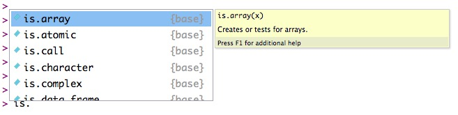
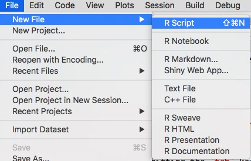
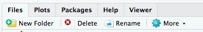

```{r setup, include=FALSE}
knitr::opts_chunk$set(echo = TRUE, 
                      tidy = TRUE,
                      collapse = FALSE,
                      warning = FALSE,
                      message = FALSE,
                      cache = TRUE)
```

# Preliminaries
> We're not slow; we're not fast. We're half-fast. 

(Joke my Dad didn't think I got as a kid.)

This tutorial is intended as a very slow introduction to using R.
If we're going too slow for you, that's ok.
But if we're going too fast, please say so!
We think that by going slow at the start, it will be easier to speed up later.

## Talking to the computer

We talk about programming a computer or coding, but most of the time we're having a conversation.
We say something, and the computer responds.
We say something else, and the computer responds.
And so on.

In this section, we'll learn how to talk to the computer in a language it understands.
That language is R.

## Why learn R?

It's fun.
It's free
You can amaze your friends and dazzle your rivals.
It's powerful, especially for manipulating, plotting, and analyzing data.

**It will make you a more productive researcher.**
That's the bottom line.

> What if I want to learn another programming language?

Awesome! 
Good for you. 
Learn a bunch of languages.
They're a bit like human languages: It's easier or more poetic to say some things in some languages than it is in others.
But make sure you develop some mastery over one computer language before learning another one.
Other useful languages for behavioral scientists to learn include the following: Python, Matlab, *nix shell programming, HTML/CSS/JavaScript, SQL, C/C++, and Java, for starters.

## Why RStudio?

[RStudio](http://rstudio.com) is an integrated development environment (IDE) for R.
RStudio brings together a number of useful tools for talking to the computer in R.
You don't have to use RStudio to use R, but you should use it for this bootcamp, and we *strongly* recommend using it in the future.
It's suitable for beginners and experts.

# RStudio and the Console

## RStudio

I'm going to login to a version of RStudio that Penn State hosts so that Penn Staters can use RStudio from a web browser.
Detailed instructions can be found at <http://psu-psychology.github.io/r-bootcamp-2018/rstudio-tlt.html>.

In brief, I enter [https://lxclusterapps.tlt.psu.edu:8787](https://lxclusterapps.tlt.psu.edu:8787) in my browser, enter my PSU Access ID (rog1) and password, then click on the the `Sign In` button with my mouse or press return on my keyboard.
Then I see an RStudio window that looks very much like this one:


This is the default view.
It has several different "windows" or panels.
They each provide us with helpful information.
You can rearrange them or customize RStudio to your heart's content.
But do that later.
For now, let's concentrate on the panel on the left side called the `Console`.

## Console

The console is where you do most of your talking to R.
Notice that there is some text, and then a greater-than sign (`>`) sign.
Let's read the text.

Besides the version of R and some other details, it tells us how to start a conversation with R.
It says `Type 'license()' or 'licence()' for distribution details.`
Let's try that.
Type 'license()' right after the greater-than `> ` sign.
Press the `return` or `enter` key on your keyboard to tell R you've finished saying something.

```{r}
'license()'
```

<!--  -->

Well, that wasn't very interesting.
The computer responded by repeating what we'd typed, changing the single quotation marks for double quotation marks, but that's about it.

> Painful lesson #1: Computers are super-literal. They are anally literal. You're not going to change them. Just deal.

Try typing `license()` *without* the single quotation marks (and hit return/enter).

```{r}
license()
```

<!--  -->

Much better!
So, this was our first 'conversation' with the computer.
We said something in R, and the computer responded.

Why did typing `license()` work but typing `'license()'` not work?
The single quotation marks.
Typing `license()` without them gave R a command; surrounding the same characters with single quotation marks told R that all of those characters were a single unit a string of characters (called a *string*), but definitely *not* a command.
As I said, computers are *very* literal.
Many of the errors and frustrations you will encounter in your R journey will come down to your not telling the computer what to do in EXACTLY the way it needs to be told.

### Parts of the console

The console refers to the whole window or panel.
Notice that as we type text or R does, that text scrolls up so we can see the recent history of our conversation.
You can scroll (with your mouse or arrow keys) up and down in the console.

The greater-than (`> `) character is called the 'prompt', and the vertical line or pipe character (`|`) is called the 'cursor'. 
You already knew about the cursor from your experiences in other computer programs.
It's where characters we type will be entered.
The prompt is just a character to 'prompt' or remind us that R is waiting for us to say something.

### Interacting with R via the console

Typing in the console is just one way to talk to the computer.
It's *interactive*, meaning we type, it responds.
Or really, we command, it responds (if it can).
This way of talking to computers is very old school.
It goes back to the 60s.
It might seems less powerful than say clicking buttons or menu items or talking to Siri or Alexa.
But just wait and see.
The console is our window into the computer's brain.

What's happening under the hood here?
When the console displays the prompt it means that R is waiting for you to do something.
That something is to type something and hit the `return` key.
When you hit `return`, R tries to 'understand' what you typed and do something sensible in response.

> Complex programs are just long sequences of commands entered into something like the computer's console and the computer's responses to those commands.

# Talking to R

So, what can you say to R?
You can give R commands and ask it simple questions.

When you type things that end with parentheses like `license()`, that commands R to do something, in this case, to 'print the license information'.
Why doesn't R require you to say `print_license()`?
To save typing.

Here's another command: `sum(1, 4, 7)`
```{r}
sum(1, 4, 7)
```

This command says 'calculate and print the sum of the numbers 1, 4, and 7'.
R responds with the answer: 12.
Notice that there are two parts to the command: the 'what to do' part (`sum`) and the 'what to do it with or on' part inside the parentheses, here `(1,4,7)`.
We'll return to this later, but many, many things we want to do or say in life (and R life) have two parts, the 'verb' or action we want to do and the 'noun' or objects/people we want to involve in that action.
The parentheses tell R which is which when it reads the command from the console.

## Files and folders/directories

Before we talk about other things you can say to the computer, let's talk about where and how computers store data and instructions.

Computers store data & instructions (programs, scripts etc.) in two types of memory:

  - **Long-term** (between work sessions) in files
  - **Short-term** (during your work session) in volatile memory. These items will not be saved across sesions unless you do something to save them.
  
We'll talk about files first.
  
Files are organised in directories or folders.
Directories/folders often have a hierarchy.
The set of directories to a file is called the **path**.

I can list the files in a directory or folder using the `list.files()` command or list the directories using the `list.dirs()` command.

```{r}
# List the files in my current directory
list.files()
```

Notice that files have names (e.g., `slow-r`) and extensions that start with a period (e.g., `.Rmd`).
The extension is a way for the computer to communicate with itself and others what type of file is being stored.
You're probably familiar with files that have one of these extensions: .docx, .xlsx, .html, and .pdf.

In addition to knowing 'what' files are already stored, we often want to know 'where' they are stored.
In computer terms, this means that we want to know where we are working in this hierarchy of directories or folders.
The get working directory or `getwd()` command shows us this information.

```{r}
# Get and print the current working directory
getwd()
```

As you continue your jouRney with R, you'll want to practice a form of 'situational awareness': Where am I now (in my computer's file system).
Don't worry, this will eventually become second nature to you.

In the next section, we'll see how we can store information in R's short-term memory.

## Assignments

Here's another useful command: `my_age <- 55`.

```{r}
my_age <- 55 # Rick's age
# Text that is preceded by the # character is called a comment.
# These are 'notes' you can keep about your code so you remember why you
# did something. Here, R ignores the part after the #: ' Rick's age'
```

This command tells R to 'assign the name "my_age" to the number 55'.
The 'assign the name' command is that leftward arrow (`<-`) symbol.
You can type it the easy way by typing `option` and the minus `-` keys at the same time (Mac OS) or the `alt` and `-` keys on Windows.
You can also type it the hard way by typing a `<` and then `-`.
But train your fingers to type it the easy way.

When we use the assignment command, we create a new object in R's short-term memory with that object's name.
We can list the objects in R's current short-term memory with the list objects or `ls()` command:

```{r}
# List the objects in R's current environment
ls()
```

The `ls()` command doesn't show me the *contents* of the object I just created, but it does show me that R has stored something.
Unless I do something special to save it, this object will disappear when I quit R.
But don't worry.
We'll show you how to save information you care about for futuRe work sessions.

### (Optional) Assignments are another type of command

Why does R have two different ways of accepting commands, one that uses parentheses like `do_something()` and one specific for the 'assign the name' command?
Because the 'assign the name' command is very similar to what you learned in algebra class when you were told you could give names to numbers, like $a=1$.
R's syntax assigns to the value (on the right side) the name (on the left).
So, really, R is doing something like `assign('my_age', 55)` when you type `my_age <- 55`.
In fact, they're the same thing.
Try it.

```{r}
assign('my_age', 55)
my_age   # Tells R to print the current value assigned to 'my_age'
your_age <- 25
your_age # Print the value assigned to 'your_age' 
```

So, if you want to be consistent in commanding R, you can always use the `command()` syntax.
Even stranger, this works, too:

```{r}
`<-`('your_age', 27) # Wonky way to show that the assignment operator is a command
# Note that we have to surround the `<-` with back ticks.
your_age
```

By the way, R accepts the equal sign `=` character to assign names (on the left) to values (on the right), just like the convention in math.

> Don't use `=`. You can, but don't. Use `<-`.

Why?
It's a recommendation about style, not substance.
But style matters.
It's like saying 'like' all the time. Like people will like understand you, but they'll wonder why you like say like all the time when you really need not. It's also a topic that will get you in a 'flame war'. 
**Avoid flame wars**.
Ok, there are more substantive reasons we'll talk about later.

## Asking questions

We can also ask R questions.
By typing comparison operators (`==`, `!=`, `>`, `<`, etc.) we can ask R true/false questions.
```{r}
1 == 0
sqrt(9) < 4
'rick' == 'rick'
'richard' > 'rick'
'richard' != 'rick'
```
R will respond with `TRUE` or `FALSE` to these questions.
Yes, `TRUE` and `FALSE` must be in all caps.

```{r}
'true' == TRUE
'False' == FALSE
```

This is because `TRUE` and `FALSE` are not just character strings to R.
They have special meaning as Boolean (logical) variables.
We'll say more about them later.

Notice that `==` asks if the two things are equal and `!=` asks if they are unequal.
This is different from what you learned in math class, where $a=1$ could be either a statement (or assignment command) or a question.
If computers had invented math, rather than the reverse, they would have separated making statements or commands from asking questions--for clarity.

If you want to think of this in a "commanding" way, you could say that you are commanding R to 'compare these two things and print TRUE or FALSE depending on the outcome of the comparison'.

## Rules for naming things

R has rules for names.
You'll be fine if you do the following:

1. Replace spaces with underscores (`_`), and 
2. Start names with letters, not numbers.

So, `bigly`, `good_name`, `a_longer_good_name`, `Good_name1`, and even `thisIsCamelCaseNoUnderscores` but not `!good`, `bad name` or `1_very_bad_name`.
There are other rules and exceptions, but this is a good place to start.

## What can we talk about?

You may be unimpressed with our conversations with R, at least so far.
But let's recap.

We can talk about numbers: `75` or `4^2` (4 to the 2nd power), `3.14159`, or `1.5e-3` (0.0015).
Notice that we type numbers 'in the nude' or without surrounding them with quotation marks.
We *can* surround numbers with parentheses, though: `(75) == 75`.
Here, parentheses function just like they do in math, so $(10-8)+1$ is equal to three:

```{r}
(10-8)+1 == 3
```
So, R is a very big pocket calculator.

You can use R for other calculations: subtraction (`-`), multiplication (`*`), division (`/`), or exponentiation (`^` or `**`, i.e. $4^2$ is written `4^2` or `4**2` in R).

We can also talk about strings, or sets of letters, numbers, and characters: `'Fourscore and seven years ago'` or `'RStudio'` or `'R 3.5'`.
Unlike names, strings *can* have spaces (and special characters like $ or !) in them or start with numbers--as long as the string starts and ends with quotation marks.
The quotation marks tell R where the string starts and where it ends.

```{r}
my_name <- 'Rick'
my_quest <- 'The Holy Grail'
favorite_color <- 'Blue, no green'
```

R treats strings, numbers, and logical values (`TRUE` and `FALSE`) as different beasts most of the time.

```{r}
'one' == '1'

# More predictable way of checking whether two things are identical
identical(12, '12')
```

We can also talk about *commands*, so `help('sum')` commands R to give us helpful information about the `sum()` command.

```{r}
help('sum')
```

Notice that we have to put the name of the command in quotation marks.
That tells R that we are telling R to 'help us learn about the command "sum"', not giving R the command to sum something.

> You can use either single or double quotation marks for strings, but I recommend using double ones. And don't mix and match: `'R will hate this"`

## Summing up

These are the basic building blocks:

- We type commands or questions into the Console, and R does our bidding...as long as we follow the rules that R requires for us to understand one another.
- We can talk about numbers, strings, logical values, and commands.

And very soon, we'll see how we can talk about collections of numbers and strings (e.g., data) and sequences of commands (scripts or programs).

## Your turn

Let's get our fingers working on a tutorial using the [`swirl` package](https://swirlstats.com/).
Install `swirl`.

```
install.packages('swirl')
```

And load it.

```
library(swirl)
```

Then, start the program.

```
swirl()
```

Tell swirl your name, if you like.
Then choose `1: R Programming` by entering the number `1` and pressing `return`.
Then choose `1: Basic Building Blocks` by entering the number `1` and pressing `return`.

Your console should look something like this:


Work through the lesson and have fun!

### Help with `swirl`

The following commands may be useful when you are running `swirl`:

```
| When you are at the R prompt (>):
| -- Typing skip() allows you to skip the current question.
| -- Typing play() lets you experiment with R on your own;
| swirl will ignore what you do...
| -- UNTIL you type nxt() which will regain swirl's
| attention.
| -- Typing bye() causes swirl to exit. Your progress will
| be saved.
| -- Typing main() returns you to swirl's main menu.
| -- Typing info() displays these options again.
```

# Object types and classes

Let's pick up the pace.
In this section, we'll talk more about the various types of objects R can store and how to manipulate them.

## Types of things

At the deepest level, everything, and I mean _everything_ in a computer is represented by sequences of 1's and 0's, data, programs, images, sounds, videos, _everything_.
So, the computer needs to know what *type* of thing a given sequence of 1's and 0's is defined to be in order to know how to do computations on it.
Does the sequence of binary digits (bits) "0011000" mean the number 48 (in binary or base 2), or the [ASCII character](https://en.wikipedia.org/wiki/ASCII) "0", or the "address" in the computer's memory where a given piece of data is stored, or a SUM() function or command?
It could be any of these.
The computer doesn't know, but working with R and your operating system (Mac OS, Windows, *nix), the computer can figure this out.

Why should you care?
Remember we said that computers are super-literal?
That's why the computer returns `FALSE` when we say `identical('1', 1)`, or when we try to add things that can't be added.

```{r, eval=FALSE}
'1' + 1
```

The character `'1'` is a completely *different* thing (different type) to the computer than the number `1`.
So, when humans interact with the computer, we sometimes forget this, and that can cause errors and (to humans) grief.

### (Optional aside) Why 1's and 0's?
One reason is pragmatic: It's relatively easy to make electronic circuits that are either "on" or "off".
If we decide that "on" means 1, and "off" means 0, then we can do computations with these states.

### (Optional aside) What sort of computations?

Algebraic computations (addition, subraction, multiplication, division, etc.) and [Boolean algebra](https://en.wikipedia.org/wiki/Boolean_algebra) sorts of computations, that's what.
Boolean algebra (or Boolean logic) takes as input the logical values of `TRUE` or `FALSE` and combines them using combinations of three basic operations: AND, OR, and NOT.
R has operators--simple programs or functions (`&`, `|`, and `!`--that implement Boolean algebra.

```{r}
TRUE & TRUE # Ampersand '&' is the AND operator
TRUE & FALSE

TRUE | FALSE # The pipe '|' is the OR operator
FALSE | FALSE

!TRUE        # the exclamation point '!' is the NOT operator
```
It turns out that these simple operations are *incredibly powerful* when combined together.
Basically, you can create simple arithmetic operations (addition, multiplication) from Boolean (AND, OR, NOT) elements.
And from there, we can make any 'computable' function.
What's computable and what's not?
That is a deep and unresolved question we won't touch, but one that computer scientists wrestle with all the time.

### (Optional) Your turn

For more practice with these concepts, try this `swirl` lesson: `8: Logic`.

## Classes

There could be a lot more to say about types, but we won't here.
Instead, we'll say that R does a lot of checking 'under the hood' to make sure we don't try to do things that don't make sense, like adding a character and a number.
R does this by creating "classes" of things that obey certain rules.

```{r}
is.numeric(99)

is.numeric('99')
is.character('99')

ten_number <- 10
ten_character <- '10'

is.numeric(ten_number)
is.numeric(ten_character)
is.character(ten_number)
is.character(ten_character)
```

The `is.numeric()` command tells R to tells us whether the inputs are 'numeric', and the `is.character()` command tells it to report whether the input contains a set of characters.

The `is.logical()` command reports whether its input is a Boolean (`TRUE`/`FALSE`) variable, and the `is.na()` command reports whether the item is a special type R reserves for *missing values*.
Yes, R has a special value called `NA` it assigns to data elements that are missing for one reason or another:

```{r}
my_data_are_missing <- NA
is.na(my_data_are_missing)
```

Note that `NA` is a 'naked' value like `TRUE` or `FALSE`, that is, it is not enclosed in quotation marks.
This will be extremely useful later, as we can tell R exactly how to handle 'missingness' in our data.

Beyond these simple ones, R implements many different object classes.
To see some of them, type `is.` then pause or type the 'tab' character.
This will show you a scrollable list of all of the `is.` commands you can try out on a given object.



The first item on the list tests to see if the input is an 'array'.
That is what we turn to next.

## Groups of things

You'll often want to make groups of things or compute over them.

### Combine (or concatenate) `c()` command

The 'combine' or `c()` command is just for this purpose.

```{r}
my_numbers <- c(1,2,3,4,5)
my_numbers
```

You can also combine characters.

```{r}
(my_initials <- c("R", "O", "G"))

# Surround an expression with parentheses to print it
(my_name <- c("Rick", "Owen", "Gilmore"))
```

But if you mix numbers and characters, the `c()` command will force the outputs to be characters.

```{r}
(lyrics <- c("It's easy as", 123))
```

We'll show you how to make a list that mixes numbers and characters very soon.

*But for now, if you just want to make one big character string from separate parts use the `paste0()` command, as in `paste0("My ", "country ", " tis", " of thee.")`*

```{r}
paste0("My ", "country ", "tis ", "of thee...")
```

Notice that the combine (`c()`) command puts things in a long row.
How long is that row?

```{r}
my_name
length(my_name)
```

Notice that the `length()` command reports the number of individual components.

```{r}
# The colon ':' operator (a:b) tells R to generate a sequence from a to b
(more_numbers <- c(-6:15))
length(more_numbers)
```

And it works for combined sets of character strings.

```{r}
length(c("a", "bc", "def", "ghij"))
```

### Sequence `seq()` and replicate `rep()` commands

There is a command for creating orderly sequences.

```{r}
# The sequence 'seq()' command can also do this
(more_numbers_alt <- seq(from = -6, to = 15))
(just_evens <- seq(from = -6, to = 15, by = 2))
```

And you can go backward.

```{r}
seq(from = 5, to = -5, by = -1)
```

As you might predict, the replicate `rep()` command makes copies of things.

```{r}
rep(7, times = 7)
all_you_need_is <- rep("Love", times = 3) 
```

These commands create a vector or 1 dimensional set of items--they have a single length.
But what about other types of structures with more than one dimension?

### Your turn

Take a few minutes to complete the `swirl` lesson related to this topic.
If you've exited swirl, start it again.

```
swirl()
```

Enter your name (again), but this time in response to `| Would you like to continue with one of these lessons?` select `2: No. Let me start something new.`.

Choose `1: R Programming` and then `3: Sequences of Numbers`.

If you wish, you may also try completing `4: Vectors`.

### Matrices and Arrays

You can create a 2-dimensional array of numbers or *matrix*.

```{r}
(square_matrix <- matrix(1:16, nrow = 4))
(not_square_matrix <- matrix(1:16, ncol = 2))
```

Notice that the `nrow` and `ncol` values tell R what shape the matrix would have.
What happens if `nrow * ncol` is not equal to the length of the input?

```{r}
(bad_matrix <- matrix(1:25, nrow = 4))
```

R warns you that there is a problem, but it tries its best to create a matrix of the shape you want by recycling old values.
You probably won't make many matrices on your own.

A 'matrix-like' object with more than 2 dimensions is called an *array*.

```{r}
(my_array <- array(1:24, dim = c(2,3,4)))
```

Notice that the `dim` parameter tells R how to build the array.
It tells R that there will be 4 'rows' of matrices, with 3 columns and 2 rows in each.

By the way, if your data is a matrix, the `length()` command may not always work the way you want it to.

```{r}
length(my_array)
```

But the dimension command `dim()` does.

```{r}
dim(my_array)    # Usually what you actually want
```

You may find yourself with matrix or array data like this, but I find it easy to get confused about what the different dimensions mean and what order they are produced.

It's possible to give the dimensions some plausible meanings using the `dimnames` parameter.

```{r}
# dimnames must be a list with each component a vector of labels that has the same length as the dimensions
my_named_array <- array(1:24, dim = c(2,3,4), 
                        dimnames = list(c("M", "F"), 
                                        c("Mon", "Wed", "Fri"), 
                                        c("ht", "wt", "shoe", "IQ")))
my_named_array
```

This is 'old school' though.
These days, most R data analysts work with data frames.
Let's talk about them now.

### Data frames

R has a powerful way of organizing data that makes it both human- and machine-friendly: *data frames*.
Data frames are like arrays and matrices, but much more useful for humans because they can contain mixtures of numbers and character strings.
Under the hood, data frames can contain many dimensions like arrays.

```{r}
# Create the data frame
my_df <- data.frame(data = 1:24, 
                    gender = c("M", "F"), 
                    day = c("Mon", "Wed", "Fri"), 
                    measure = c("ht", "wt", "shoe", "IQ"))

# Print the data frame
my_df
```

Notice that R has turned our 3 dimensional data (gender, day, measure) into a 2 dimensional table.
The rows contain complete observations; the columns the variables.
This 'rectangular' data shape is called 'tidy'.
It may seem wasteful to repeat 'M' and 'F' in each row, but it's crystal clear what we mean.
We'll talk more about the virtues of tidy data [^2] tomorrow, but keeping your data tidy (observations in rows, variables in columns, longer than wider) is a best practice you'll want to adopt.

### Lists

Data frames are one way to combine numbers and character strings.
They work great for data, but no so much for other, less well-structured, sorts of information.
Lists are just what you'd expect: flexible aggregations of things.

```{r}
(my_list <- list('donald', 72, '1600 Pennsylvania Ave'))

# Can give names to the components
(my_list_wnames <- list(first_name = 'donald', 
                        age = 72, address = '1600 Pennsylvania Ave'))
```

R uses lists extensively, especially when reporting various sort of statistical tests.

```{r}
# Take a random (normally distributed) sample of numbers with a mean = 3
r_100 <- rnorm(n = 100, mean = 3, sd = 1)
(t_test_r_100 <- t.test(r_100))

is.list(t_test_r_100)
names(t_test_r_100)
```
So, it turns out that that nice print out is made up of a list with different named components.
That will come in handy soon.

### Your turn

Before we break for lunch, let's get our hands dirty again by taking the relevant `swirl` lesson: `7: Matrices and Data Frames`.

## Indexing (getting parts out)

We've talked about how to put things into vectors, arrays, matrices, data frames, and lists.
How do we get things out?
It's easy.

### Accessing elements via 'indices'

We just tell R the index (or 'address') of the item.

```{r}
(one_to_ten <- 1:10)
one_to_ten[5]
```

Notice that we put the index in square brackets `[]`, not parentheses.
Again, **square brackets are for indexing**.
**Parentheses are for commands and functions**.
You'll make this mistake a lot.
I still do.
Don't worry.
R will tell you.

```{r, eval=FALSE}
# See what happens when you type this
(one_to_ten(5))
```

What about matrices or arrays?
They have more than one dimension.
Yes, you'll need more than one index.

```{r}
dim(my_array)
my_array[2,3,4] # The last item in each dimension
my_array[1,1,1] # The first item in each dimension
```

Of course, you have to keep track of how to map the indices to the row/column/table values.
In fact, Dr. Hallquist tells me that he strongly **discourages** the use of numeric indices to extract information from arrays.
It's too easy to make a mistake.
So, learn our mistakes.
Make your own new ones.

If you label your matrices and arrays, you can do something slick.

```{r}
my_named_array['M', 'Fri', 'IQ']
```

### Indexing data frames

You can pull data our of data frames using numeric indices, but you have to remember that your data frame is now 2 dimensional, e.g., you need to use something like this: `my_df[row_indices, col_indices]`.

```{r}
my_df
my_df[1,4]     # row 1, column 4
my_df[1:3,3:4] # rows 1-3, and columns 3-4
my_df[,2:3]    # All of the rows from cols 2 and 3
my_df[1,]      # All of the columns from row 1
```

#### Accessing elements by name

An often more useful way to index data in data frames is to use the names of the columns.
We can extract entire columns using the dollar sign `$` or 'extract' operator.

```{r}
names(my_df)   # What are the column names?
my_df$data
my_df$gender
```

If you read the help for this operator (`help('$')`) you'll note that you can also use it to create new or replace old values.

```{r}
# Make new lower case gender variable
(my_df$new_gender <- tolower(my_df$gender))
```

#### Accessing elements by logical (Boolean) values

Knowing this, we can use Boolean (true/false) expressions to create a vector of TRUE/FALSE values that correspond to some condition.

```{r}
(only_males <- (my_df$gender == 'M'))
```

Let's unpack this.
We're selecting all of the `gender` values from `my_df` with `$`, so `mf_df$gender` returns only the `gender` column from the data frame.
Then we ask R to test (`==`) which of those are males `'M'`.
R returns a vector of `TRUE/FALSE` values that correspond to whether each item in `my_df$gender` is equal to `M`.

With this in hand, we can then select from `my_df` all of the data for the males.

```{r}
my_df[only_males,] # All rows with TRUE values for only_males
```

Notice that we put `only_males` as the first index in `my_df`, before the comma: `my_df[only_males,]`.
This means that R will return the *rows* of the data frame where `only_males` has `TRUE` values.
Recall that data frames are two dimensional.
The syntax for indexing them is of this form: `df[row_index, column_index]`.
We didn't specify which columns to return--the column index is empty--so R returns all of the columns.

What about the females?

```{r}
# M and F are mutually exclusive, so F is just the opposite of M
only_females <- !(only_males)
my_df[only_females,]

my_df[!(only_males),] # Equivalent
```

We can mix and match logical indices.

```{r}
fav_day_mon <- (my_df$day == 'Mon')
my_df[fav_day_mon & only_females,]
```

And we can select one or more specific columns by name.

```{r}
my_df[fav_day_mon, c('measure', 'gender')]
```

It can be confusing when to surround a variable name with quotations and when not to.
When you use the extract (`$`) operator, don't surround the variable you're extracting with quotations: `my_df$gender` not `my_df$'gender'`.
When you're indexing a variable by name, surround it with quotation marks: `my_df[,'gender']` not `my_df[,gender]`.
Why?
If you aren't using `$` or quotations `''`, R won't look for `gender` inside `my_df`, but will look for it, and fail to find it, among the objects it has already stored.

By the way, you don't have to create a separate logical variable.

```{r}
my_df[my_df$gender == 'M',]
```

But it may be easier for you (or someone else) to read your code if you make a separate logical variable.
Be kind to your future self.

### Indexing lists

Remember our $t$ test from a bit ago?

```{r}
(t_test_r_100)
```

What if we want to use these data without having to copy and paste?
Can we pull the values out?

```{r}
(names(t_test_r_100))
t_test_r_100$statistic # t value
t_test_r_100$parameter # df value
t_test_r_100$p.value   # p value
```

So, using this information along with some syntax we'll learn later, we can retrieve the information we need from R **without error-prone copying and pasting**!:

Our randomly generated set of numbers has a mean value of `r t_test_r_100$estimate`, $t$(`r t_test_r_100$parameter`) = `r t_test_r_100$statistic`, $p$<`r t_test_r_100$p.value`.

We'll talk about how to use R Markdown to implement this technique later this afternoon.

## Summing up

Here are some rules of thumb about indexing different objects:

- If you know the actual index numbers or have named variables, use square brackets `[]`.
- If you want to pick a subset of your data that meets some specific criterion you can define, then create a new Boolean variable for that criterion and use it as an index.
    - You can embed the Boolean expression in your index, but that makes for hard-to-read code.
- Many things in R (data frames, lists) can be extracted using the extract `$` operator.

## Your turn

If you want additional practice with some of these ideas, try the `swirl` lesson `6: Subsetting Vectors`.

# Packages, scripts, and functions

We've learned how groups of things can be made and how to extract the parts of aggregate objects.
Now let's see what happens when we combine groups of commands together.

## R packages

Base R can do quite a bit, but the real power of R is that there is a huge community of developers creating sets of powerful and useful functions that you can install and use.
Functions are specialized commands to R that take inputs and generate outputs.
Sets of functions that relate to some topic, technique, or theme are called 'packages'.
Some include datasets, are called 'packages'.
To view the packages that are already installed, press `ctrl-7` to view the 'Packages' panel.
The packages with checkmarks are currently active R.

As an illustration, let's look at the help for R's 'Base' Package, loaded by default when you start R.

```{r}
library(help = "base")
```

We see that there are all sorts of basic functions here, including the `sum()`, and `seq()` commands we used earlier and mathematical functions that can come in handy in other contexts.

You might want to look at the help for the 'stats' package, which is also loaded by default:

```{r}
library(help = "stats")
```

You'll see a number of functions that look like they do familiar things, the `t.test()` function, for example.
Unless you customize your R environment, R will automatically load the following packages at start-up: `stats`, `graphics`, `grDevices`, `utils`, `datasets`, `methods`, and `base`.
When there is a new version of R released, it involves changes to these core packages.

Packages often depend on other packages; these are called dependencies.
A well designed package specifies what dependencies it has, and the default behavior of R is to download and install those, too.

### Installing packages

The 'Install Packages...' item in the 'Tools' menu opens a window where you can specify the package or packages you want R to install.
To install a package from the Console, use the `install.packages()` command.
You may note that R assumes you want to download packages from the [Comprehensive R Archive Network (CRAN) website](https://cran.r-project.org/).
This is the 'official' repository for R packages that have undergone a certain level of automated testing and peer review.
Some very useful packages have not yet made it into CRAN and are hosted elsewhere, such as on GitHub.

### Using a package's data or functions

Once you've installed a package, you'll need to tell R that you want to use the commands in the package.
The clearest way to do this is to use the package name when you call a particular function.
So, if we've already installed the `ggplot2` package via `install.packages('ggplot2')`, we can do this:

```{r}
ggplot2::qplot(rnorm(100))
```

This tells R to use the `qplot()` function from the `ggplot2` package to i) generate a random normal set of 100 numbers and ii) plot them.

Try typing `ggplot2` and pausing or hitting the `tab` key.
You'll see a pop-up list of functions in the `ggplot2` package.
Again, this is the best way to call function from a package because it is unambiguous about what function we want.

An older, alternative way is to load the package into memory using the `library()` command.
If we enter `library('ggplot2')` at the Console, then we can type the simpler expression `qplot(rnorm(100))` to create the plot.
This seems like less typing.

So, why do I recommend the other way?
Because some packages use the same names for very similar functions.
If you load both into memory, R won't know which package you want, and so it will choose for you.
R will warn you when it makes this choice saying 'function X is masked by package Y'.
Usually, the developers of packages don't create functions with identical names that do incompatible things, so it's not a huge source of worry.
The problem is magnified when you start to share your code with other researchers who don't have all of the same packages installed as you do.
So, that's why it's better practice to be specific about the package(s) you're using when you use particular functions.
In fact, CRAN requires this when you create a package for review.

## Scripts and functions

The real power of R, or really any programming language, stems from the combination of single steps to form more complex and useful wholes.
Not only can we use functions other R experts have provided via packages, but we can create our own customized sequences of work and save them for later reuse in the form of scripts and functions.

### Source pane

While it can be fun and instructive to work solely in the Console, for most real work, you'll want and need to put commands in a place you can easily reuse them.
That place is called the 'Source' pane.
It's `ctrl-1` on your keyboard.

Why is it called source?
It's the source of inspiration, the source of your soon-to-be-realized statistical genius.
And the term comes from the computer world where every project starts out as 'source code'.

### Scripts

Let's make some source code.
Press `shift-(command or control)-n` (that's 3 keys at one time) to create a new R script file called `Untitled1`.



Press `ctrl-1` to make sure that you are typing in the Source pane in the `Untitled1` window.

You can type in this window now, but I urge you to get in the habit of doing two things:

1.  Typing in a comment line so you know what's to come.
    - Comments require a `#` in the first column.
    - So something like `# R Bootcamp work 2018-08-16` might be a good name.
    - Why the weird date format? It's unambiguous across the world, and it sorts nicely.
2. Saving the file.
    - Where to save it and with what name can get very...personal.
    - I strongly suggest you start and maintain your own file directory structure so that you can find things in the future.
    - My suggestion would be to have a structure like this:
        - `courses/2018_r_bootcamp/`
    - And then save the file as `2018_08_16_script.R` under that directory.

Later today, I'm going to sharpen and modify this recommendation slightly by adding a step that takes advantage of RStudio's project management functionality.
For now, this will be okay.

Now you can type R code and comments in the Source pane.
Let's try something (modestly) useful.

```
# Generate data
data_mean_zero <- rnorm(n = 100, mean = 0, sd = 1)
data_mean_nonzero <- rnorm(n = 100, mean = 3, sd = 1)
```

When you've typed this, press `(command/control)-s` to save it.

What do these commands do?
The `rnorm()` command creates a random sample of normally distributed numbers.
The `n`, `mean`, and `sd` parameters specify the size of our sample, its mean and standard deviation.
Notice the different sample means.

Now, type in two additional rows of commands.

```
# Print histograms
hist(data_mean_zero)
hist(data_mean_nonzero)
```

Hit `(command/control)-s` to save.

What is this new `hist()` command?
Let's ask R to tell us.
Hit `ctrl-2` to go to the Console.
Type `help('hist')` and hit enter.
You can also type `??hist` to see a broader search of R's help pages for other commands that start with these letters.

So, this script is going to generate some data and plot histograms. 
Let's run the `hist()` commands.
Move up or down arrow into the line with the `hist(data_mean_zero)` command.
Hit the `Run` button at the top of the Source panel.
**Notice** that R moves the highlighted line down by one each time you press the `Run` button.

What if you don't want to take your hands off the keyboard to do this?
Good for you!
You can run the current line by pressing `shift+enter`.
Try that.

Now, let's add two more lines to our script.

```
# Run t-tests
(t.test(data_mean_zero))
(t.test(data_mean_nonzero))
```

You can predict what these will do.
Confirm it by running the lines.

If you didn't save the file, the name will be highlighted in red.
Save it now.

### 'Sourcing' a script

Now that you've saved a sequence of commands, you can run the whole (saved) sequence from the console.
Switch to the console with `ctrl-2`.

Enter `source('2018_08_16_script.R')` (or whatever name you have given your script) but do not press enter yet.
Let's see what the `source()` command does.
Press `esc` to clear the console.
Type `help('source')` to view the documentation about `source()`.
Now, we know that it will take the source file we provide and send it to the R console.
Make sure you're still in the console by pressing `ctrl-2`.
Type `source(file = "` and hit `tab` to see a list of files in your local directory.
If you see the script file you created and saved, hit return to select it.
Then press the right arrow key to the end of the line, and type `)` to close the command and `enter` to run it.

You may also run the script from the Source panel.
Press `ctrl-1` to switch to the Source.
Press `ctrl-s` to make sure the file is saved.
Press the `Source` button in the right corner of the Source panel.

Why do the plot shapes change each time?

### PaRameteRize your (R) life

So, this script is fine, but it could be better.
What if we want to try different values for the means or the standard deviations or the number of samples?

Add this text to the top of your script file.

```
# Parameters
mean_1 <- 0
mean_2 <- 3
sd_1 <- 1
sd_2 <- 1
samples_1 <- 100
samples_2 <- 100
```

Then, edit the next few lines as follows

```
(data_mean_zero <- rnorm(n = samples_1, 
                         mean = mean_1, 
                         sd = sd_1))
(data_mean_nonzero <- rnorm(n = samples_2, 
                            mean = mean_2, 
                            sd = sd_2))
```

See how we've substituted the new parameters for specific values?
Save the script and source it.

If you want to see different plots, switch to the Plots panel (`ctrl-6`) and press the left or right arrow buttons.

The virtue of this approach is that we can edit the parameters in the script and see the effects of the changes pretty quickly.
The downside of this approach is that we still have a lot of duplicate typing.

## From scripts to functions

Scripts are great.
Functions are even better.
Functions further reduce typing and other sorts of errors.

Let's make our own function to see why.
It can live (for now) in the same script file.
The basic function will look like this:

```
my_hist_t <- function() {}
```

So, we'll assign the function a name--here `my_hist_t`.
Why this particular name?
Well, it's my function, not R's, and it plots a histogram and runs a $t$ test.
It's boring, but helpful to your future self to name things in ways that are as clear as possible.
Some even suggest that functions should have verbs in their names -- `print_hist_t()` -- so we can tell them apart from other kinds of objects.

Our function will have some input parameters--not specified yet--entered inside the parentheses `()`.
And then there are the squiggly braces `{}`.
Those are new.
That's where the meat of the function goes, the commands we want to execute.

What input parameters will we want to enter?
The number of samples, mean, and standard deviation, of course.

```
my_hist_t <- function(my_samples, my_mean, my_sd) {}
```

Notice that I called the parameters `my_samples`, etc.
This is to make it easier to see what's going on inside the function.
It's often good practice to give some default values for the parameters so that your function runs even if you forget to give it input.

```
my_hist_t <- function(my_samples = 100, my_mean = 0, my_sd = 1) {}
```

If we forget (or choose not) to enter a value for one of the parameters, our function will use the defaults.
Now we type the code.

```{r}
my_hist_t <- function(my_samples = 100, my_mean = 0, my_sd = 1) {
  my_data <- rnorm(n = my_samples, mean = my_mean, sd = my_sd)
  hist(my_data)
  t.test(my_data)
}
```

Let's make sure we understand what's going on.
Inside the function (inside the curly brackets), we compute a random normal data set and assign it to `my_data`.
Then we calculate the histogram and $t$ test.
R will 'return' to us the result of the last command in the function, in this case, the results of `t.test(my_data)`.

Let's save the script and source it.
We have to do this **every time we edit the script file**.

Now switch to the `Environment` pane (`ctrl-8`).
See how there is now a function called `my_hist_t` listed?
We can now go back to the console (`ctrl-2`) and run our function with all sorts of parameter combinations:

```{r}
# Run these in the Console
my_hist_t()
my_hist_t(my_mean = 10)
my_hist_t(my_samples = 200, my_sd=5)
```

Because we've specified defaults and are naming our parameters when we call the function, R will just use the defaults when we don't specify a parameter.

There are many subtleties about writing functions that we haven't covered here.
I recommend the free [DataCamp](http://www.datacamp.com) course by Hadley Wickham on ["Writing Functions in R"](https://www.datacamp.com/courses/writing-functions-in-r) to learn more.

### Hold on, what about the equal signs?

The careful observer will note that I used the equal sign to give my function input when I called it from the console

```
my_hist_t(my_samples = 200, my_sd=5)
```

and even in the script where I created the function:

```
my_hist_t <- function(my_samples = 100, my_mean = 0, my_sd = 1) {
  my_data <- rnorm(n = my_samples, mean = my_mean, sd = my_sd)
  hist(my_data)
  t.test(my_data)
}
```

What gives?

So, remember when I said that R stores objects in volatile memory?
In fact, R stores objects in separate compartments called 'environments'.
When I create a function, R stores any variable names (and values) I assign inside it, like `my_data <- rnorm(...)` to an environment specific to the function.
This means that the value my function assigns to `my_data` is unique to that function.

When I define the `my_hist_t()` function to have inputs called `my_samples`, `my_mean`, and `my_sd`, I'm telling R to add these names to the environment for my function.
That way R is ready to use these names when their values are defined by the user when she calls my function.

> Do not use the assignment `<-` operator when defining a function's parameters. Use `=`. That is use `my_function <- function(my_parameter = 2)` not `my_function <- function(my_parameter <-2)`

Think of it this way.
When you used `source()` to load your function into memory, you told R the names of the  variables your function will use in that function's environment.
You don't need to assign those names again.
R will remember them.
You just need to some specific values to the names R already has set aside for them.
The equal sign `=` does that.

## Summing up

We've learned how to install packages via the `install.packages()` command, load packages into R's 'working memory' via `library()` and to view documentation about packages using the `library(help = "package_name")` command.

We've also learned how to type sequences of assignments and commands into the Source pane to create scripts, and we've learned how to execute those commands using the `source()` command.
We've also seen how to make a function that encapsulates these sequences into easily reproducible units, using the `function_name <- function(...arguments...) {...function commands...}` syntax.

There is much more to say and learn about functions (e.g., see this [Software Carpentry lesson](https://swcarpentry.github.io/r-novice-inflammation/02-func-R/index.html)), but this is a good start on why they're so important and useful.

# Honing your expertise

In a short first course in R, we can never cover everything, but we can hope to give you enough momentum to get started.
In this short section, we'll talk about some skills that will help accelerate your progress in learning R and RStudio.

## Practice

> The absent-minded maestro was racing up New York’s Seventh Avenue to a rehearsal, when a stranger stopped him. “Pardon me,” he said, “can you tell me how to get to Carnegie Hall?”
“Yes,” answered the maestro breathlessly. “Practice!”

<https://quoteinvestigator.com/2010/05/06/how-do-you-get-to-carnegie-hall/>

Using R and RStudio is a skill.
To gain expertise, you need to practice.
I recommend practicing at least 3-5 times a week.

## Use the keyboard

Train your fingers to limit mousing.
Press `ctrl-2` to switch to the console.
Press `up arrow` to see the recent history of your console commands.
Use the left and right arrow keys to move within/edit a prior command.
Press `ctrl-a` to go to the beginning of a line in the console; `ctrl-e` to go to the end.
Type the first few characters of a variable or command and then i) wait a bit or ii) press tab to see a list of possible completions. 
Hit up and down arrows to scroll through the list.
Hit `enter` to select an item.
Hit `escape` to clear the current line of the console.

If you want to see a window of your recent commands, go to the `History` pane by pressing `ctrl-4`.
You can use the up and down arrow keys to scroll through your previous commands.
Hitting `enter` immediately copies that command to the console and executes it.
I find it somewhat less useful than just the up/down arrow functions in the console, but YMMV.

There will be other keyboard commands.
For example, if you're not already using `(command/ctrl)+c` for copying, `(command/ctrl)+v` for pasting, and `(command/ctrl)+x` for cutting, start now.
Also, I use `(command/ctrl)+` (enlarge text) and `(command/ctrl)-` (shrink text).

## Reading code will improve your writing

It's well known that the best writers of prose, poetry, or music, are often voracious consumers.
The more comfortable you get reading others' code, the better your own writing will become.
Yes, code can be dense at times, and some coders write cleaner and more comprehensible code than others.
But in this workshop, we're trying to help speed you along the learning curve by helping you learn to read R code from the get-go.
Remember, it's critically important that code be human-readable.
Computers want 1's and 0's and don't really care about things like comments or elegant syntax or any of that.

## Getting help

Press `ctrl-3` to go to the help pane.
[RStudio](http://rstudio.com) has extensive documentation and help resources.
Google is your friend, at least in this regard..
There is also an active R community on [Stack Overflow](http://stackoverflow.com).

I often find it useful to read the documentation about a function to see what the other parameters do.
For example, typing `help('plot')` shows us that the `plot()` function takes (typically) two inputs, `x`, and `y`. The ellipsis `...` says that it also takes other optional parameters.
So, this code

```{r}
plot(x = rnorm(10), y = rnorm(10), 
     main = 'Random scatterplot',
     ylab = 'Random Y',
     xlab = 'Random X')
```

Creates a scatter plot with a title and labels for the x and y axes.

## Control/view the local environment

You'll want to practice 'situational awareness'.
That means knowing what's going on in your local R environment.

Press `ctrl-8` to go to the 'Environment' pane.
This shows us all of the Data, Variables, and Functions we have defined in the current session.
Some of the items can be expanded by clicking on the small arrow, the data frame for example.

### What's assigned to what

The Environment pane is one way to keep track of what you've assigned, but there are some other ways to do this from the console.

- The 'list objects' command or `ls()` tells you what objects and functions are in R's active memory ready for your use.
- Typing an object's name at the console and hitting `enter` will give you the current value.

If you're exploring and putting your commands in a script, you may find it useful to 'clean the slate' or start with a fresh environment before you `source()` your script. 
To do this, you can 'remove individual objects' using the `rm()` command, or remove all of them using `rm(list = ls())`.

## Finding your way around

We've mostly ignored it thus far, but when you start RStudio, all of your work is in a default directory (or folder) on your computer.
You can change this default in the 'Tools' menu, 'Global Options...' item.
Later this afternoon, I'm going to recommend that you let RStudio help you organize your work by creating a project with its own directory for each new project you take on.
But for now, let's see how we can use console commands to find out where we are.

### Working directories and navigation

To find out what directory you're currently working in, type the get working directory command `getwd()` at the console.

```{r}
getwd()
```

You'll see that I have a directory hierarchy under my home (`rick/`) directory that is specifically devoted to GitHub projects, with a subdirectory for the `psu-psychology` repository on GitHub and then this specific bootcamp project.

I can go 'up' the directory hierarchy by typing the set working directory command `setwd()` as follows:

```
setwd("../") # "../" means go up one level in the directory hierarchy
getwd()
```

To go back to where I was, I have to enter the name of the old directory where I came from.
If I remember it, I just enter the `setwd()` command again.

```
setwd("r-bootcamp-2018/")
```

But if I've forgotten, RStudio can help me.
Type the start of the `setwd('` command and then pause or hit the `tab` key.
RStudio will show you a list of the contents of the current working directory.
Use the up or down arrow keys to select where you want to change to, and then press `enter`.
Confirm that you are where you thought you wanted to be with `getwd()`.

Some researchers have workflows where they set the working directory in their scripts (using `setwd()`), but **these workflows are often more likely to break when they are shared with other people**.
Nevertheless, you will need to have a mental model of the directory hierarchy you've created for your work and be explicit about where you want data, scripts, and outputs to go.
This is critical when you start writing scripts and functions, and you want to tell your script or function where to find its inputs, like the data files you'll want to process.

For example, if my R scripts are stored in an `R/` directory under my working directory as indicated below, to `source()` them, I need to give a command like this `source('R/my_script.R)`.
And if my data are stored in a `data/csv/` directory, I may have to give my data cleaning function an input like this: `clean_my_data(path_to_data = 'data/csv/dirty_data.csv')`

So, what directory structure should you use?

### Directory structures

One of the reasons people gravitate toward careers in independent research is that they relish their independence.
So, you'll find lots of advice about how to structure the information in your projects.
Rather than tell you what structure to use, I'm going to show you some structures that I find sensible and workable for many research projects:

```
my_awesome_project/
  README.md
  data/
    raw/
      sub_001.xlsx # or ...
      sub_002.xlsx
    csv/
      sub_001.csv
      sub_002.csv
    aggregate/
  R/ # Helper scripts
  figs/
  pubs/
    papers/
    talks/
    posters/
```

This means that the `my_awesome_project/` directory is the 'home' directory for this project.

Some people prefer to organize their data by measure:

```
my_awesome_project/
  README.md
  data/
    behavior/
    mri_structural/
    mri_functional/
...
```

And others prefer to organize it by participant:

```
my_awesome_project/
  README.md
  data/
    sub_001/
      sub_001_behavior.csv
      sub_001_mri_structural/
      sub_002_mri_functional/
...
```

> Choose a directory structure that works for you and try to be as consistent as possible about it. This will make writing reproducible scripts (within and across projects) much easier.

By the way, you can automate the creation of directories using the `dir.create()` command, but I usually use the RStudio Files panel and its associated buttons.



## Configuring RStudio

You can customize your RStudio environment to your heart's content, including rearranging how the different panels appear.
Go for it.
You can modify the settings using the 'Tools' menu 'Project Options' item.
The Project Options window opens.
Here's mine.


I have strong feelings about two settings:

- `Restore .RData into workspace at startup` should be **unchecked**.
- `Save workspace to .RData on exit` should be **`never`**.

These settings ensure that you have a 'clean' R session when you start-up.
That is, that old values of variables and functions aren't still lurking about.
This may seem counter-intuitive, but it is considered a best practice for reproducible research.
You'll want to be able to re-generate your results from scratch without having old (stale, possibly outdated) values interfering with your current analyses.

# Getting data in

There are three main sources of data: R packages, the internet, and files on local computers or servers you have access to.

## Data from R packages

Base R comes with a number of datasets that can be good for learning your way around.
Type `library(help="datasets")` to see a list of them.

```{r}
library(help="datasets")
```

Type `help('mtcars')` for information about the Motor Trend cars dataset, for example.
Type `data('mtcars')` to load that dataset into memory.

## Data from the internet

There is a lot of publicly available data on the internet.
But each dataset and site has its own way of downloading.

Just to illustrate how this might work, try downloading a simple heart rate timeseries using the `read.csv()` command:

```{r}
hr_mit <- read.csv(file ='http://ecg.mit.edu/time-series/hr.11839', 
                   header = FALSE, 
                   col.names = 'HR', 
                   skip = 0)
```

The `read.csv()` command creates a data frame.
Note that we specified a URL or web address for the file and some other parameters.
This file has no header with the column names, so we said `header = FALSE`; we provided a name for the single column `col.names = 'HR'`; and we said not to skip any rows at the top of the file `skip = 0`.

```{r}
class(hr_mit)
```

Note that we don't have to surround 'hr_mit' with quotation marks because it is a name that R should know because we just defined it.

Then we can plot it using `plot(hr_mit$HR)`

```{r}
plot(hr_mit$HR)
```

### Public data from the Open Science Framework (OSF)

Samuel Mehr et al. (2018) have provided some data files using the Open Science Framework:

Mehr, S. A., Singh, M., York, H., Glowacki, L., & Krasnow, M. (2018, January 9) Datasets. https://doi.org/10.17605/OSF.IO/M9RXV

Let's download the survey data.

```{r}
mehr_etal_survey <- read.csv(file = "https://osf.io/etg8z/download")
names(mehr_etal_survey)
```

This will produce a cross tabulated table about the sex and tenure status of the respondents:

```{r}
xtabs(formula = ~ sex + tenure, data = mehr_etal_survey)
```

Here is the same table formatted in a nice way using the `knitr::kable()` function:

```{r}
knitr::kable(xtabs(formula = ~ sex + tenure, data = mehr_etal_survey))
```


## An aside about comma-separated value (CSV) files

Spreadsheets are incredibly powerful computational tools.
But they are terrible ways of storing data you want to use in R.

Imagine a future for yourself where you rarely do any manipulation or visualization of data using a spreadsheet.
Work to realize that future as soon as possible.

Why?
Because you want to produce open, transparent, and reproducible scientific workflows using data and processing pipelines that are findable, accessible, interoperable, and reusable (FAIR) [^1].

Comma-separated value (CSV) files are text files with items separated by commas, and rows separated by new line or return characters.
CSV files have the file extension `.csv`.
All spreadsheet programs can export and import CSV files.

CSV files are the *lingua franca* of the data science world, followed closely by tab-delimited files (where `tab` characters replace the commas), JavaScript Object Notation (JSON), and eXtensible Markup Language (XML).
Here is a tutorial about CSV files: <https://swcarpentry.github.io/r-novice-inflammation/11-supp-read-write-csv/>

### Reading 'foreign' file formats

Notwithstanding the fact that we urge you to store data in comma-separated text files, you will often want and need to work with data files stored in other formats.

The 'foreign' package (`install.packages('foreign')`) contains commands to read SPSS files (`foreign::read.spss()`), Stata files (`foreign::read.dta()`), Systat files (`foreign::read.systat()`), and Minitab files (`foreign::read.mtp()`).

SAS files can be imported using the `sas7bdat` package (`install.packages('sas7bdat')`).

The `xlsx` package (`install.packages('xlsx')`) contains commands to read MS Excel (.xlsx) spreadsheets.

These functions all operate to create an R data frame.

## Local data

Much or most of the time, you'll want to load data into R that is stored on your computer or on a server you have access to.

> It is a best practice to read-in your data file each time you return to work on your project.

## Exploring data

Once we have loaded a dataset, we can poke around.
We'll use the `mtcars` dataset since it's part of base R.

```{r}
data(mtcars)
class(mtcars)
str(mtcars)   # What is the structure of mtcars?
names(mtcars)
```

These commands load the dataset, show that it's a data frame, and show us the names of the columns or variables.
We can look at the top (head) and bottom (tail) of the dataset.

```{r}
head(mtcars) # display first 6 cases
tail(mtcars) # display last 6 cases
```

We can also summarize the data with the `summary()` command.

```{r}
summary(mtcars)
```

And, we can even plot all of the data.

```{r}
plot(mtcars)
```

We can choose specific subsets of variables like before, and even customize the way the histogram looks:

```{r}
guzzlers <- mtcars$mpg < 20
hist(mtcars$mpg[guzzlers],
     main = "Gas Guzzling Cars in the mtcars dataset",
     xlab = "Miles Per Gallon (mpg)")
```

## Summing up

- Use `read.csv()` to read comma-separated value text files
- Use other commands as needed
- Goal is to import a data frame
    - `str()` to show structure of data frame
    - `names()` to show column names
    - `summary()` produces summary statistics
    - `plot()` creates a matrix of plots, pitting each variable against the other

# Materials

This document was produced on `r Sys.time()` in [RStudio](http://rstudio.com) version 1.1.453 using R Markdown.
The code and materials used to generate the slides may be found at <https://github.com/psu-psychology/r-bootcamp-2018/>. 
Information about the R Session that produced the slides is as follows:

```{r session-info}
sessionInfo()
```

## Notes

[^1]: Wilkinson, M. D., Dumontier, M., Aalbersberg, I. J. J., Appleton, G., Axton, M., Baak, A., Blomberg, N., et al. (2016). The FAIR guiding principles for scientific data management and stewardship. *Scientific Data*, *3*, 160018. Retrieved from http://dx.doi.org/10.1038/sdata.2016.18
[^2]: Wickham, H. (2014). Tidy Data. *Journal of Statistical Software*. Retrieved November 19, 2016, from https://www.jstatsoft.org/article/view/v059i10