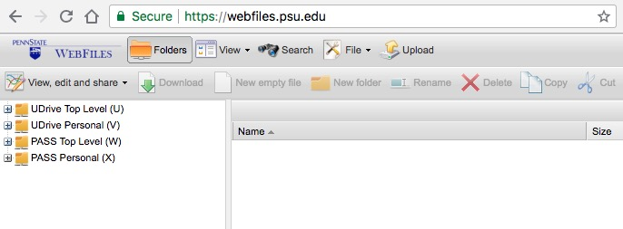

```{r setup, include=FALSE}
knitr::opts_chunk$set(echo = TRUE)
library(tufte)
```

## Purpose

This document describes how to log-on and use Penn State's RStudio Server instance from a web browser.

## Prerequisites

1. A Penn State [Access Account](http://www.identity.psu.edu/services/authentication-services/access-accounts/) user ID (e.g. rog1).
2. A web browser.
3. A computer that is connected to the Penn State network via [PSU wifi](http://wireless.psu.edu/wireless.html), or a physical network connection, or a connection to Penn State's network via a [Virtual Private Network (VPN)](http://kb.its.psu.edu/article/891) application like Cisco AnyConnect.
    
## Procedure

1. Connect to the Penn State network.

2. Start your web browser.

3. Connect to [https://lxclusterapps.tlt.psu.edu:8787](https://lxclusterapps.tlt.psu.edu:8788) or to [https://lxclusterapps-bygone.tlt.psu.edu:8788/auth-sign-in](https://lxclusterapps-bygone.tlt.psu.edu:8788/auth-sign-in). You should see the following login page:


4. Enter your PSU access ID (e.g., rog1) in the `Username` field (Do **not** add `@psu.edu`), and enter your PSU password in the `Password` field. 
The use of a password manager like LastPass, 1Password, or DashLane is highly recommended.

5. Hit the `Sign In` button or press return on your keyboard.
You should see an RStudio window that looks very much like this one.


You are now ready to use RStudio Server!

## RStudio Server and PASS space

The RStudio Server application uses your PASS space for file storage.

To access your PASS space and upload files to it (like data),

1. Visit [https://webfiles.psu.edu/](https://webfiles.psu.edu/). You will see a login window like this:
    


2. Enter your Penn State Access ID (e.g. rog1) and password. You should see the WebFiles interface:
    


3. Click on the `PASS Personal (X)` text or the `+` icon in the left panel.
This will open a window on the right that shows the contents of your PASS space.
    
4. You may create new folders, upload, and download files using the WebFiles application.

5. Press the `logout` button in the upper right to logout when you are finished.
