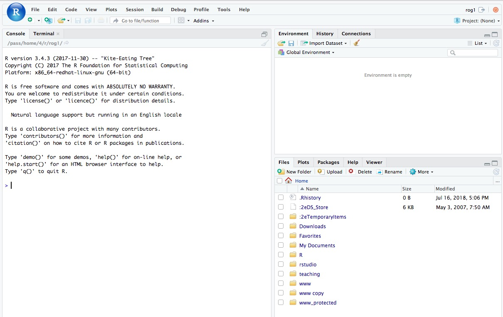
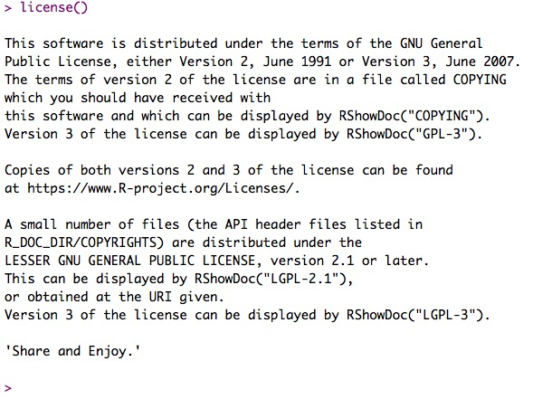

```{r setup, include=FALSE}
knitr::opts_chunk$set(echo = TRUE)
```

## The slow-R tutorial

> We're not slow; we're not fast. We're half-fast. 

(Joke my Dad didn't think I got as a kid. Actually I didn't until I was a teenager.)

## Talking to the computer

We talk about programming a computer or coding, but most of the time we're having a conversation.
We say something, and the computer responds.
We say something else, and the computer responds.
And so on.

In this section, we'll learn how to talk to the computer in a language it understands.
That language is R.

### Why learn R?

It's fun.
It's free
You can amaze your friends and dazzle your rivals.
It's powerful, especially for manipulating, plotting, and analyzing data.

**It will make you a more productive researcher.**
That's the bottom line.

> What if you want to know or learn another programming language?

Awesome! 
Good for you. 
Learn a bunch of languages.
They're a bit like human languages: It's easier or more poetic to say some things in some languages relative to others.
But make sure you develop some mastery over one computer language before learning another one.
Other useful languages to learn include the following: Python, Matlab, *nix shell programming, HTML/CSS/JavaScript, SQL, C/C++, Java.

> Why do you want to learn R?

### Open RStudio

[RStudio](http://rstudio.com) is an integrated development environment (IDE) for R.
RStudio brings together a number of useful tools for talking to the computer in R.
You don't have to use RStudio, but you should use it for this bootcamp, and we strongly recommend using it in the future.

I'm going to login to a version of RStudio that Penn State hosts so that Penn Staters can use RStudio from a web browser.
I enter [https://lxclusterapps.tlt.psu.edu:8788](https://lxclusterapps.tlt.psu.edu:8788) in my browser, enter my PSU Access ID (rog1) and password, then click on the the `Sign In` button with my mouse or press return on my keyboard.
Then I see an RStudio window that looks very much like this one:



This is the default view.
It has several different "windows" or panels.
They each provide us with helpful information.
You can rearrange them or customize RStudio to your heart's content.
But do that later.
For now, let's concentrate on the panel on the left side called the `Console`.

### Console

The console is where you do most of your talking to R.
Notice that there is some text, and then a greater-than sign (`>`) sign.
Let's read the text.

> What does it tell us?

Besides the version of R and some other details, it tells us how to start a conversation with R.
It says `Type 'license()' or 'licence()' for distribution details.`
Let's try that.
Type 'license()' right after the greater-than `> ` sign.
Press the `return` or `enter` key on your keyboard to tell R you've finished saying something.


Well, that wasn't very interesting.
The computer responded by repeating what we'd typed, changing the single quotation marks for double quotation marks, but that's about it.

> Painful lesson #1: Computers are super-literal. They are anally literal. You're not going to change them. Just deal.

Try typing `license()` without the single quotation marks (and hit return/enter).



Much better!
So, this was our first 'conversation' with the computer.
We said something in R, and the computer responded.

Why did typing `license()` work but typing `'license()'` not work?
The single quotation marks.
Typing `license()` without them gave R a command; surrounding the same characters with single quotation marks told R that all of those characters were a single unit called a string, *not* a command.
As I said, computers are *very* literal.
Many of the errors and frustrations you will encounter in your R journey will come down to your not telling the computer what to do in EXACTLY the way it needs to be told.

#### Parts of the console

The console refers to the whole window or panel.
Notice that as we type text or R does, that text scrolls up so we can see the recent history of our conversation.
You can scroll (with your mouse or arrow keys) up and down in the console.

The greater-than (`> `) character is called the 'prompt', and the vertical line or pipe character (`|`) is called the 'cursor'. 
You already knew about the cursor.
It's where characters we type will be entered.
The prompt is just a character to 'prompt' or remind us that R is waiting for us to say something.

#### Interacting with R via the console

Typing in the console is just one way to talk to the computer.
It's *interactive*, meaning we type, it responds.
Or really, we command, it responds (if it can).
This way of talking to computers is very old school.
It goes back to the 60s.
It might seems less powerful than say clicking buttons or menu items or talking to Siri or Alexa.
But just wait and see.
The console is our window into the computer's brain.

What's happening under the hood here?
When the console displays the prompt it means that R is waiting for you to do something.
That something is to type something and hit the `return` key.
When you hit `return`, R tries to 'understand' what you typed and do something sensible in response.

> Complex programs are just long sequences of commands entered into something like the computer's console and the computer's responses to those commands.

### Talking to R

So, what can you say to R?
You can give R commands and ask it simple questions.
That's pretty much it.