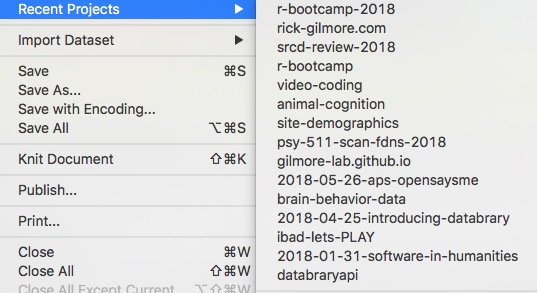
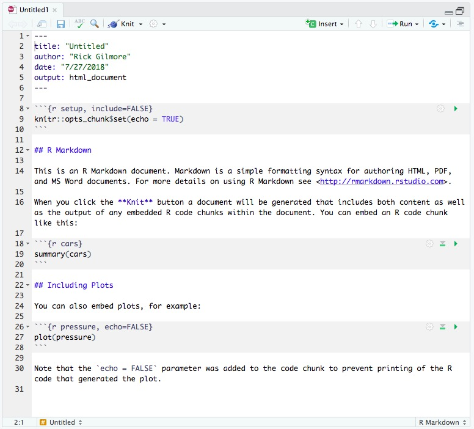
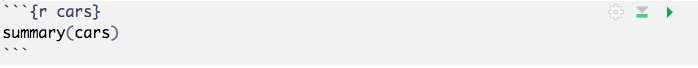

```{r setup, include=FALSE}
knitr::opts_chunk$set(echo = TRUE,
                      warning = FALSE,
                      message = FALSE,
                      cache = TRUE)
library(tidyverse)
```

# Themes

1. The reproducibility crisis
2. What does reproducible science look like?
3. Using R & RStudio for R-eproducible science
4. Advanced topics in R-eproducible science
5. The future of reproducible psychological science
        
# The reproducibility crisis

I like to start off talks about reproducibility in science with some humor.
This video is a few years old, but it has some timeless insights.

<iframe width="560" height="315" src="https://www.youtube.com/embed/66oNv_DJuPc" frameborder="0" allowfullscreen></iframe>

<https://www.youtube.com/embed/66oNv_DJuPc>

What's the point?
That even the most well-meaning of us can make careless errors that undermine the reproducibility of science.

But, is it a crisis?

In 2016, Nature published the results of a survey of 1,500 scientists ([Baker 2016](http://doi.org/10.1038/533452a)).
They were asked a number of questions, including the following:

## Is there a reproducibility crisis?

- Yes, a significant crisis
- Yes, a slight crisis
- No crisis
- Don't know

---

<div class="centered">
<a href="http://www.nature.com/polopoly_fs/7.36716.1469695923!/image/reproducibility-graphic-online1.jpeg_gen/derivatives/landscape_630/reproducibility-graphic-online1.jpeg" height=450px>

</a>

[Baker 2016](http://doi.org/10.1038/533452a)
</div>

### Results from our own bootcamp poll

We'll dig into the workflow for gathering, cleaning, and visualizing the bootcamp survey data a little later.
But let's see what we all said in response to the same question.

```{r load-2018-Bootcamp-survey, include=FALSE}
survey <- read.csv("../data/survey_clean.csv")

# Change order of responses for printing
survey$Crisis <- factor(survey$Crisis, 
                        levels = c("Yes, significant", "Yes, slight", "No", "Don't know"))

survey_plot <- survey %>%
  ggplot() +
  aes(x=Crisis, fill=Crisis) +
  geom_bar() +
  xlab("Response") +
  ggtitle("Is there a reproducibility crisis in psychology?")
```

<div class="centered">
```{r plot-survey, echo=FALSE}
survey_plot
```
</div>

## Problems with reproducibility extend beyond psychology and behavioral science

<div class="centered">
<a href="http://www.nature.com/polopoly_fs/7.36718.1464174471!/image/reproducibility-graphic-online3.jpg_gen/derivatives/landscape_630/reproducibility-graphic-online3.jpg">

</a>

---

<div class="centered">

</div>

## Why is reproducibility hard?

<div class="centered">
<a href="http://www.nature.com/polopoly_fs/7.36719.1464174488!/image/reproducibility-graphic-online4.jpg_gen/derivatives/landscape_630/reproducibility-graphic-online4.jpg">

</a>

[Baker 2016](http://doi.org/10.1038/533452a)
</div>

### A manifesto for reproducible science

[[@Munafo2017-dc]](http://doi.org/10.1038/s41562-016-0021)

<div class="centered">
<a href="http://www.nature.com/articles/s41562-016-0021/figures/1">

</a>
</div>

# What does reproducible science look like?

## What do we mean by 'reproducibility'?

[Goodman et al., 2016](http://doi.org/10.1126/scitranslmed.aaf5027)

- *Methods* reproducibility
    - Enough details about materials & methods recorded (& reported)
    - Same results with same materials & methods
- *Results* reproducibility
    - Same results from independent study
-*Inferential* reproducibility
    - Same inferences from one or more studies or reanalyses
    
## Achieving *methods* reproducibility

How do we record enough details about all of our data, materials, and methods so we can fully reproduce our analysis? Have we captured (and reported) enough details about all of the steps of our project:

- Data collection
- Cleaning
- Visualization
- Analysis
- Reporting
- Manuscript, talk, poster preparation.

One way to answer the question is to think about that introductory video.
Another way is to think about the 'hit by a truck' scenario

<div class="centered">

</div>

In other words, **could someone else (in your lab or another lab) pick up where you left off without significant loss of time and momentum if you weren't there?**.
This is a high bar to reach, but it's feasible with the right tools and mindset.

> No one is irreplaceable, but strive to be indispensible.

## RStudio projects

RStudio has a 'projects' function that I strongly recommend you use.

- Create using 'File/New Project'
- Store in new directory with sensible name ('projects/1st_year_proj')
- Creates *.Rproj file
- Turn-off saving data to the .RData file
- 'File/Open Project...' command opens 'fresh' workspace

I create a new project every time I start a new 'thing'.
That occurs surprisingly often.
Here's an example of some recent projects I've worked on.

<div class="centered">

</div>

Using RStudio projects helps keep your files and settings organized.
It's easy to switch between projects.
It reduces mental effort (what directory am I in?), and especially avoids having to use directory-setting commands like `setwd()` that will only work on *your* computer
RStudio projects also integrates with version control (e.g., GitHub).

## Reproducible workflows

- Scripted, automated = minimize human-dependent steps.
- Well-documented
- Be kind to your future (forgetful) self
- Transparent to me & colleagues == transparent to others

# Using R (and RStudio) for reproducible science

## Scripting

Think of each step of your data workflow

```
# Import/gather data

# Clean data

# Visualize data

# Analyze data

# Report findings
```

Imagine writing R code to handle each step.

```
# Import data
my_data <- read.csv("path/2/data_file.csv")

# Clean data
my_data$gender <- tolower(my_data$gender) # make lower case
...
```

You could put all the code in one script file, or even better, have separate scripts for each step that you `source()` one by one.

```
# Import data
source("R/Import_data.R") # source() runs scripts, loads functions

# Clean data
source("R/Clean_data.R")

# Visualize data
source("R/Visualize_data.R")
...
```

### Scripts: Strengths & Weaknesses

- R commands in files that can be re-run
- Separate pieces of workflow kept separate
- "Master.R" script that can be run to regenerate full sequence of results
    - Error in raw data file?
    - No problem; fix data file and re-run "Master.R"
- How to save results or share with collaborators?

## [R Markdown](https://rmarkdown.rstudio.com/)

[R Markdown](https://rmarkdown.rstudio.com/) is an add-on package to R, developed by the RStudio team.
R Markdown allows you to write a single text document that combines text, code, images, videos, and equations into one document.
R Markdown then let's you render that document in a number of formats: a PDF or MS Word document, a web page or site, slides, a blog, or even a book.

> One tool to rule them all and in the R-ness, bind them.

If you don't speak LOTR, just ignore that.

### What is [R Markdown](https://rmarkdown.rstudio.com/)?

R Markdown extends [Markdown](https://daringfireball.net/projects/markdown/syntax) [^3], a scripting 'language' used in lots of blogging engines and wikis.
Markdown is a simple formatting syntax for authoring HTML, PDF, and MS Word documents.
It's designed to be easy for humans to write and for machines to read.

You can learn the basics of R Markdown in a very short time.
And there are several resources for doing so we recommend:

- RStudio has an [R Markdown page](https://rmarkdown.rstudio.com/) with extensive documentation, including some very useful [cheatsheets](http://rstudio.com/cheatsheets)
- Hadley Wickham, the author of `ggplot2` and other R packages has an online [tutorial](http://r4ds.had.co.nz/r-markdown.html)
- Psychologists Mike Frank and Chris Hartgerink have produced a nice [tutorial](https://libscie.github.io/rmarkdown-workshop/handout.html) that they gave at the 2017 Society for Improving Psychological Science (SIPS) meeting.

### The anatomy of an R Markdown file

Let's create a simple R Markdown file so we can see how this works.
From the 'File' menu select 'New File...' and then the R Markdown file type.


Notice that the 'New R Markdown' window let's us choose different types of documents, presentations, an interactive web application using Shiny, or another file from some template.
We'll just use the defaults and create a new Untitled document that gives as its default output an HTML file.


Let's expand the Source panel so we can see the full file.



The template shows us the core components of an R Markdown file:

#### Header

The header is marked off from the rest of the document by dashes `---`.
The header contains metadata about the document, contained in different 'fields': `title`, `author`, `date`, and `output`.

```
---
title: "Untitled"
author: "Rick Gilmore"
date: "7/27/2018"
output: html_document
---
```

All of these can be edited.
The `title` can and often should be different from the file name.
The `date` field is filled out automatically [^1].
The `output` field shows that this document will be converted into an `html_document` that we can open in any web browser.

#### Body text

The body text starts with the double hash marks `##`.
R Markdown follows Markdown's convention of using hash marks to specify heading levels as in an outline.
One hashmark means the 1st or top level.
Two hashmarks means the 2nd level, etc.[^4]

Note that we can include clickable web links by surrounding URLs with angular brackets `<>`, make text **boldface** by surrounding it with double-asterisks `**boldface**` or in *italics* with single asterisks `*italics*`.

R Markdown allows other kinds of content to be inserted in body text:

- Named [links](http://psu-psychology.github.io/r-bootcamp)
- Images: 
- Equations: $e = mc^2$

and even video or audio recordings using HTML.

#### Code chunks

Code chunks are separated from the body text by triple back-ticks '```'.

Let's look at the *second* code chunk:



Text in brackets `{r cars}` tells R that this chunk contains code written in R [^2] and gives the chunk the name `cars`.
The name is optional, and must be unique within a file, but it can help in debugging a long R Markdown file.
In this case, the chunk runs the `summary()` command on the `cars` dataset.

When you create your own R Markdown documents, you will put your R code inside a chunk.
You can create new chunks by clicking on a blank line in the R Markdown document and typing `CTRL+ALT+I`.

The virtue of putting code in chunks is that you can run them piece by piece from within the document.
For example, clicking on the small right arrow icon runs the current chunk.

Scrolling down to the next code chunk, we see that it plots data from the `pressure` dataset: `plot(pressure)`.


Returning to the first chunk called `setup`, we see that chunks themselves can have options that specify whether or not they are displayed `echo=FALSE` in the document, whether or not chunks are evaluated `eval=TRUE` and so forth.
This allows the user to customize how the document executes each chunk.

#### Rendering output

Edit the body text if you like, then render the document using the `Knit` button.
If we have not saved the file, we may be prompted for a file name, you can use `test.Rmd` for now.
This will generate a `test.html` file (per the `output: html_document` in the header).
Let's open that file.
We can see that the document combines the body text, links, R code chunks and R code ouputs, including plots in a very readable way.

One of the virtues of R Markdown, of course, is that we could produce different output formats for the same file, either by changing the `output` field in the document header or by issuing a command in the console:

```
rmarkdown::render("test.Rmd", output_format = 'pdf_document')
rmarkdown::render("test.Rmd", output_format = 'word_document')

# More than one output_format
rmarkdown::render("test.Rmd", output_format = c('html_document',
                                                 'pdf_document',
                                                 'word_document'))
```

### R Markdown using 2018 R bootcamp data
 
I've analyzed the survey data you provided using an R Markdown document [bootcamp-survey.Rmd](bootcamp-survey.Rmd).
Let's open it up and see how it looks.

The default format is an `html_document`, and I've added some additional parameters in the header to produce a table of contents `toc: yes` with numbered sections `number_section: TRUE`, that floats `toc_float: TRUE`.

```
output:
  html_document:
    toc: TRUE
    toc_depth: 3
    toc_float: TRUE
    number_section: TRUE
```
I've also added parameters so I can easily produce outputs in different formats.
Notice that I've added comments about what I did and why, so that the R Markdown file is like a combination lab notebook and data report.
And by creating it in R Markdown, I can satisfy many audiences with different needs.

Your adviser likes PDF?
No problem.
Your collaborator prefers MS Word?
Got it covered.
Need to give a quick brown bag talk you can give from any web browser?
Easy.

# Advanced topics in R-eproducible science

- Write *reproducible papers* in R Markdown using [`papaja`](https://github.com/crsh/papaja)
    - Make [this](gilmore-hallquist-bootcamp-2018-papaja.pdf) from [this](gilmore-hallquist-bootcamp-2018-papaja.Rmd)
- Version control with git and [GitHub](http://github.com)
- [Web sites](http://rmarkdown.rstudio.com/rmarkdown_websites.html), [blogs](https://bookdown.org/yihui/blogdown/), (even [books](https://bookdown.org/)) with R Markdown

## Writing reproducible papers in R Markdown

The previous example showed how we might create reproducible data analysis reports in R Markdown.
It's only a short step to writing full papers this way.
But let's talk about *why* we might want to do this.

### Why write reproducible papers? ([Frank & Hartgerink](https://github.com/mcfrank/openscience_tutorial/blob/master/rmarkdown_handout.Rmd))

**The following is section is copied verbatim from Mike Frank & Chris Hartgerink's tutorial on GitHub**.

There are three reasons to write reproducible papers. 
To be right, to be reproducible, and to be efficient. 
There are more, but these are convincing to us. In more depth:

To avoid errors. 
Using an automated method for scraping APA-formatted stats out of PDFs, [[@Nuijten2015-ul]](http://doi.org/10.3758/s13428-015-0664-2) found that over 10% of p-values in published papers were inconsistent with the reported details of the statistical test, and 1.6% were what they called "grossly" inconsistent, e.g. difference between the p-value and the test statistic meant that one implied statistical significance and the other did not. 
Nearly half of all papers had errors in them.

To promote computational reproducibility. 
Computational reproducibility means that other people can take your data and get the same numbers that are in your paper. 
Even if you don't have errors, it can still be very hard to recover the numbers from published papers because of ambiguities in analysis. 
Creating a document that literally specifies where all the numbers come from in terms of code that operates over the data removes all this ambiguity.

To create spiffy documents that can be revised easily. 
This is actually a really big neglected one for us. 
At least one of us used to tweak tables and figures by hand constantly, leading to a major incentive never to rerun analyses because it would mean re-pasting and re-illustratoring all the numbers and figures in a paper. 
That's a bad thing! 
It means you have an incentive to be lazy and to avoid redoing your stuff. And you waste tons of time when you do. 
In contrast, with a reproducible document, you can just rerun with a tweak to the code. You can even specify what you want the figures and tables to look like before you're done with all the data collection (e.g., for purposes of preregistraion or a registered report).

### Example of a reproducible paper using the `papaja` package

It's possible to write a paper like [this](gilmore-hallquist-bootcamp-2018-papaja.pdf) from an R Markdown document that looks like [this](gilmore-hallquist-bootcamp-2018-papaja.Rmd).

The `papaja` package makes this possible.
Let's peek under the hood to see how this is done.

#### Headers in `papaja`

The header has some specialized fields, but we can easily understand most of them.

```
---
title             : "R you ready to write a paper in R Markdown?"
shorttitle        : "R you ready"
author: 
  - name          : "Rick O. Gilmore"
    affiliation   : "1,2"
    corresponding : yes    # Define only one corresponding author
    address       : "Department of Psychology, The Pennsylvania State University, University Park, PA 16802 USA"
    email         : "rogilmore@psu.edu"
  - name          : "Michael Hallquist"
    affiliation   : "1"
affiliation:
  - id            : "1"
    institution   : "The Pennsylvania State University"
  - id            : "2"
    institution   : "Databrary.org"
author_note: |
  The authors are with the Department of Psychology at The Pennsylvania State University.
  The authors acknowledge support from the Department of Psychology, the Social, Life, & Engineering Sciences Imaging Center (SLEIC), and the Child Study Center's Open Data in Developmental Science (ODDS) initiative.
abstract: |
  Want to write a paper using R Markdown? Keep reading to see how.
  
keywords          : "APA, R Markdown"
wordcount         : "Not that many."
bibliography      : ["r-references.bib", "references.bib"]
figsintext        : no
figurelist        : no
tablelist         : no
footnotelist      : no
lineno            : yes
lang              : "english"
class             : "man"
output            : papaja::apa6_pdf
editor_options: 
  chunk_output_type: console
params:
  data_file_in: '../data/survey_test.csv'
---
```

#### Main paper sections

Notice that we set the chunk options so that chunks will run, but not echo their outputs or show warning or error messages.

```
knitr::opts_chunk$set(echo = FALSE, warning = FALSE, error = FALSE)
```
This keeps the final output clean.

We load the required packages for our paper, and then write our introduction.

```
It is possible to write an entire APA-formatted article in R Markdown. 
This very brief paper shows how it might be done.
As illustration, we use the data from a short, informal survey of participants in the 2018 R Bootcamp at Penn State.
```

The methods section is specified as a level 1 `#` heading, with the subsections denoted by level 2 `##` headings.

```
# Methods {#methods}
Consistent with open and transparent science practices, we report how we determined our sample size, all data exclusions (if any), all manipulations, and all measures in the study [@Simmons2011-za].

## Participants {#participants}

We asked participants in an optional "R Bootcamp" held at the Pennsylvania State University Department of Psychology on August 16 and 17, 2018 to complete an anonymous survey using a Google Form.
We asked participants to report how old they felt.
A total of $n=$`r length(survey$Psych_age_yrs)` respondents answered the survey with a reported felt age of $M$=`r mean(survey$Psych_age_yrs)` and a range of [`r min(survey$Psych_age_yrs)`-`r max(survey$Psych_age_yrs)`] years. 
```

The package uses the tags in braces `{#methods}` in generating a table of contents.
Notice that we can add in-text references using the `[@paper_id]` syntax if we've created a bibliography file in the BibTex format (.bib).
Notice also that we can freely mix LaTex syntax for equations (`$n=$` becomes $n=$) with commands to produce R output `r length(survey$Psych_age_yrs)`.
This allows us to directly 'grab' information from R, including statistical values, and insert them into our document **without copying and pasting**.

> Text between dollar signs `$x=12$` will be rendered using the LaTex equation engine. Text between single backticks `r hist(rnorm(100))` will be run in the language specified by the first element, here that is `r`.

#### Making tables and figures

`papaja` builds on other R commands to allow us to make APA-formatted tables.
This chunk uses `dplyr` commands we'll learn about tomorrow to create a new data frame with some basic descriptive statistical information about the variables in our survey.
Then it creates a properly formatted table using the `apa_table()` command.

```
descriptives_Banjo <- survey %>%
  select(R_exp, Banjo) %>%
  group_by(R_exp) %>%
  summarise(Mean = mean(Banjo),
            Median = median(Banjo),
            SD = sd(Banjo),
            Min = min(Banjo),
            Max = max(Banjo))

# Drop the Timestamp column
descriptives_Banjo[, -1] <- printnum(descriptives_Banjo[, -1])

apa_table(
  descriptives_Banjo, 
  caption = "Descriptive statistics of banjo music enthusiasm by R experience.",
  note = "This table was created with apa_table()",
  escape = TRUE
)
```

Similarly, this chunk uses the `ggplot()` command to create a scatter plot of the relationship between preferred hours of sleep and enthusiasm for banjo music.

```
Banjo_vs_sleep <- survey %>%
  ggplot() +
  aes(x=Sleep_hrs, y=Banjo) +
  geom_point() +
  geom_smooth() +
  theme_apa()
Banjo_vs_sleep
```

### Summing up on writing papers with `papaja`

There's much more to say about how to do this than we have time for today.
This [guide](https://rpubs.com/YaRrr/papaja_guide) or [this](https://github.com/mcfrank/openscience_tutorial/blob/master/rmarkdown_handout.Rmd#writing-apa-format-papers) are good places to start.
But I think we can all agree that **pushing a button to render a complete paper, including tables, figures, and references, is pretty amazing.**

To be honest, I'm still learning `papaja` and have yet to create and submit a paper using it.
But I have one in late draft stage and another in process.
Let me know if you're using `papaja`, and what you think about it.
    
## Version control

Track changes is great?
Right?
But if you've ever written a lengthy document with other people, you've experienced the challenge of tracking *versions* across time.
At some point, the changes become too extensive to track, and so the author(s) decide to accept or reject a bunch and create a new version.
This is how version control becomes an extension of the track changes problem.
Most of us have experienced something like this sequence: 'paper.docx', 'paper_new.docx', 'paper_new_new.docx', 'paper_new_new_ROG.docx', etc.

My current scheme with colleagues is something like this: 'nsf_grant_2018-08-16v1.docx', 'nsf_grant_2018-08-16v2.docx', etc.
That is, each person who modifies the document saves it as a new version.
It doesn't avoid conflicts if we're working in parallel, but it does help us track down where we went astray.

Imagine a scheme for doing this automatically with your R and RStudio files?
RStudio incorporates two 'version control' systems from the software development world, 'git' and 'subversion'.
I use 'git' and a web-based service for managing projects that use git called [**GitHub**](http://github.com).

### Rick's GitHub workflow

We don't have time to go into git and GitHub here, but I strongly recommend Jenny Bryan's tutorial [Happy Git and GitHub for the useR](http://happygitwithr.com/).
In the meantime, this is the workflow I use for almost every project I do that will involve R:

1. Create a repo on GitHub
2. Copy repo URL
3. `File/New Project.../`
4. Version Control, Git
5. Paste repo URL
6. Select local name for repo and directory where it lives.
7. Open project within R Studio `File/Open Project...`
8. Commit (upload a commented version) early & often

These videos show this workflow in action.

<div class="centered">
<video height="440" width="720" controls>
  <source src="../mov/rstudio-project-on-github-1.mp4" type="video/mp4">
  Your browser does not support the video tag.
</video>
</div>

---

<div class="centered">
<video height="440" width="720" controls>
  <source src="../mov/edit-save-commit-push-1.mp4" type="video/mp4">
Your browser does not support the video tag.
</video>
</div>

This way, I always have local and web-based copies of my latest work.
It's easy to share with collaborators.
I just send them a URL to the project.
This is how Michael and I worked together on the bootcamp.
And it's how I create all of my teaching and talk slides.

> When using a GitHub workflow with collaborators, you **must** get in the habit of 'pushing' your work to GitHub when you finish and 'pulling' the latest version from GitHub when you start working again. It's not Dropbox or Box.

## [Web sites](http://rmarkdown.rstudio.com/rmarkdown_websites.html) with R Markdown

When I say most of my work these days is in RStudio, I'm not kidding.
It's easy to create simple websites that start out as R Markdown documents.
The bootcamp's website is an example.

If you're curious about this, please feel free to examine the 'guts' of the bootcamp's repository. It includes a [`_site.yml`](../_site.yml) file that contains site configuration parameters, an [`index.Rmd`](../index.Rmd) home page for the site and other `*.Rmd` files that get converted into pages, and directories for files.

To create the site, I simply enter `rmarkdown::render_site()` from the console, commit the changes and push them to GitHub. 
GitHub has its own web hosting service called [GitHub pages](https://pages.github.com/) that makes it easy to create and modify simple websites.

# The future of reproducible psychological science...

I'm very optimistic about the future of psychological science.
Our science is harder than physics, chemistry, and engineering because it incorporates phenomena from all of them.
And the survey data show that failures to replicate in these other fields are common, more common than most outsiders would imagine.
Behavioral scientists are becoming more mindful of the challenges to robustness in our work and are making strides to bolster it.

## Let's learn more, faster

At the end of the day, by making our research more reproducible, our findings will be more robust, and by sharing our findings, displays, data, and analysis code more widely and openly, we'll all learn more, faster.
That's Databrary's motto, by the way.

So, I think that in the very near future we'll see the following:

- transparent, reproducible, open workflows across the publication cycle
- Openly shared materials + data + code
- [[@Munafo2017-dc]](http://doi.org/10.1038/s41562-016-0021): reproducible practices across the workflow
    - Including procedure videos [[@Gilmore2017-eh]](http://doi.org/10.1038/s41562-017-0128)
- Data, materials (displays, code) stored in central repository
    - Open Science Framework ([OSF](http://osf.io))
    - [Databrary](http://databrary.org)
- [[@Gilmore2017-eh]](http://dx.doi.org/10.1038/s41562-017-0128): video and reproducible behavioral science
- Access/analyze materials/displays via repository application program interfaces (APIs)

These will Building a 'cumulative' science  [[@Mischel2011-br]](https://www.psychologicalscience.org/observer/becoming-a-cumulative-science)

## Learn from my mistakes

I still consider myself a 'student of R'.
I learn new tricks and techniques all the time.
You **can** teach an old dog new tricks.
He just has to be motivated.
It takes longer, and you have to be patient.

But you can learn from my mistakes:

- Script **everything** you possibly can
    - If you have to repeat something, make a function or write a parameterized script
- Document **all the time**
    - Comments in code
    - Update README files
- Don't be afraid to ask
- Don't be afraid to work in the open
- Learn from others
- Just do it!

<iframe src="https://giphy.com/embed/pvDp7Ewpzt0o8" width="480" height="264" frameBorder="0" class="giphy-embed" allowFullScreen></iframe><p><a href="https://giphy.com/gifs/star-wars-yoda-the-empire-strikes-back-pvDp7Ewpzt0o8">via GIPHY</a></p>

In many ways, learning R is like acquiring a super power.

<div class="centered">

</div>

So, go be super-powerful.
But remember that with great power comes great responsibility.

# Materials

This document was produced on `r Sys.time()` in [RStudio](http://rstudio.com) version 1.1.453 using R Markdown.
The code and materials used to generate the slides may be found at <https://github.com/psu-psychology/r-bootcamp-2018/>. 
Information about the R Session that produced the slides is as follows:

```{r session-info}
sessionInfo()
```

## Notes

[^1]: A best practice is to change the `date` field so that it is automatically updated each time the file is rendered: `date: '`r Sys.time()`'`.
[^2]: R Markdown can contain code written in languages other than R!
[^3]: Hypertext Markup Language (HTML) is the core language of web pages. 'Markdown' is a markup language for easily writing a file that gets converted to HTML.
[^4]: HTML has different header levels that these map to: so <H1>, <H2>, etc.

## References